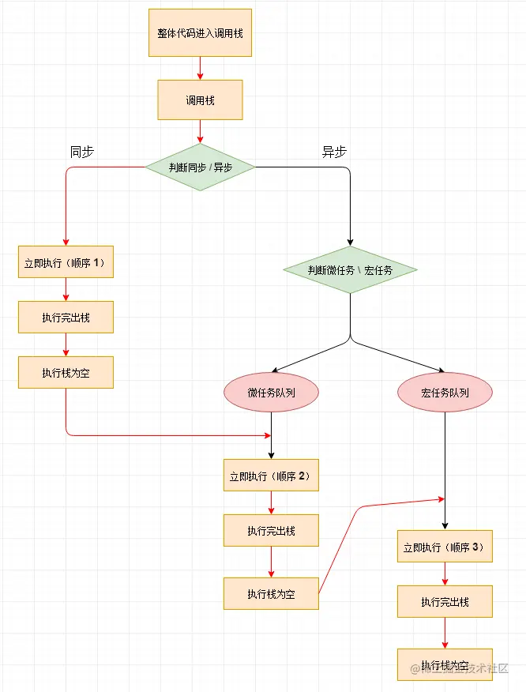

# JavaScript进阶

## **箭头函数和普通函数的区别**

1.普通函数有自己的**arguments**（类数组对象）而箭头函数没有自己的**arguments**对象，若想要访问参数，接收参数需要剩余参数语法(...)来接收

**2.this的绑定,对于普通函数而言this的绑定是动态的，取决于每一次调用函数的方式来绑定this，而对箭头函数而言它没有this，在创建之初就会this就会继承自定义时的上下文中并在之后的生命周期中都不会再改变**

3.**new**关键字：普通函数可以作为构造函数，可以使用**new**关键字来创建实例对象。当使用**new**调用普通函数时，会创建一个新对象，斌且this会指向这个新对象。但箭头函数就不可以使用**new**关键字，因为他没有自己的**this**，也没有**prototype**属性

4.**yield**关键字：普通函数可以使用yield关键字，从而生成为生成器函数（生成器函数可以暂停和恢复执行，返回一个迭代器对象）。对于箭头函数而言它不可以使用yield关键字，也不能成为生成器函数。


## 构造函数和类的区别

### 构造函数：

**特点**

**tips：**

**在JS中任何函数只要通过new操作符来调用，就可以把它当作一个构造函数，如果不用就和普通函数没有区别**

**如果静态方法中包含this关键字，这个this指的是类，而不是实例**

1.没有显示的创建对象

2.所有属性和方法赋值给this对象

3.没有return语句

**关于new---->new在本质上是是一个语法糖，并且隐式实现了面向对象编程中的实例化过程**

|    操作    |             new操作             |         手动实现          |
| :--------: | :-----------------------------: | :-----------------------: |
|  创建对象  |            自动创建             |      Object.create()      |
|  原型链接  | 自动设置（隐式原型）  __proto__ |  手动复制 obj.__proto__   |
|  构造函数  |          自动绑定this           | 手动Constructor.call(obj) |
| 返回处理值 |      自动返回this（默认）       |    手动检查返回值类型     |

{关于new的经典面试题，new操作符执行了哪些操作：（1）创建一个空对象（2）将构造函数的作用域赋值给对象（3）执行构造函数中的代码（用来给新对象添加属性）（4）返回新对象}

4.每个构造函数都有属于自己的原型属性（prototype），在prototype中有一个constructor属性指向该构造函数；在构造函数的实例对象中会包含一个指针[[prototype]]和__proto__，会指向构造函数的原型，__proto__属性是浏览器厂商附加上的，可以用于获取构造函数的原型对象

缺点：在构造函数上的方法，在每次创建新实例的时候都会重新创建一次（例：Person构造函数中有着sayHello的方法，再创建p1,p2实例这两个对象都会有sayHello的方法），在实例对象中的方法是不同的**Function**实例，又因为**Function**也是对象，因此每定义一次就会创建一个对象（会浪费空间，重复代码）

解决方案：在构造函数的原型上添上对应的方法，在创建新对象时，新实例对象可以通过prototype找到对应方法

```Javascript
function Person(){};
Person.prototype.sayHello = function(){
	console.log("Hello!");
}
var p1 = new Person();
var p2 = new Person();
p1.sayHello();
p2.sayHello();
```


### 类：

类（class）在ES6版本推出，本质上是一个语法糖，实际上还是使用构造函数来实现的(class,extends)，其原理是使用了寄生式组合继承（inherit）

**特点**

**tip：**

**类的prototype本质上和构造函数的prototype一致，类的本质就是用构造函数的寄生式组合实现的**

**如果静态方法中包含this关键字，这个this指的是类，而不是实例。**

1.在类里有一个constructor方法（构造方法），this关键字代表实例对象

2.在类内，对于普通方法不需要加上function关键字，直接定义函数

```javascript
class Person {
	sayHello:(){
        console.log("Hello");
    }
}
```

3.方法之间不需要逗号分隔，否则用了会报错

4.使用时直接调用new命令，与构造函数用法一致

5.定义的方法会自动定义在类的prototype上

6.类的内部方法都是不可枚举（属性enumerable：false）

7.类内必须有一个constructor方法接受参数（如果没有，则会默认添加一个空的），在通过new命令生成对象实例的时候，自动调用该方法，默认返回实例对象**this**

8.可以使用get和set关键字，对某个属性设置存值函数与取值函数，拦截该属性的存取行为。

9.类和模块内部默认是严格模式，不需要使用use strict指定运行模式。

10.类和类表达式不存在变量提升（不像函数）

**本质原因：**

TDZ（Temporal Dead Zone）暂时性死区

类声明实际上遵循与 let/const 相同的规则

在代码执行到声明前，该标识符会处于不可访问状态

```javascript
console.log(foo());
function foo(){};

const myClass = new MyClass(); // 报错
class MyClass {};
```

11.类方法内部，如果含有this，它默认指向类的实例

12.静态方法：类相当于实例的原型，类中定义的方法都会被实例继承，如果在一个方法前加上static关键字，表示该方法不会被实例继承，而是通过类来调用，这就称为 ‘ 静态方法 ’

13.实例属性除了可以定义在constructor方法里面的this上面，还可定义在类的最顶层，如下所示：

```Javascript
class IncreasingCounter {
  constructor() {
    this._count = 0;    // _count为实例属性
  }
  get value() {
    console.log('Getting the current value!');
    return this._count;
  }
  increment() {
    this._count++;
  }}
  
  
class foo {
  bar = 'hello';   // 实例属性
  baz = 'world';  // 实例属性

  constructor() {
    // ...
  }}

```

14.静态属性：指的是Class本身的属性，目前的写法为

```Javascript
class Foo {}

Foo.prop = 1;
Foo.prop // 1
```

15.私有属性和私有方法：在属性和方法前面加上#，就表示私有属性或者方法，在内部调用时，要加上#


## JS事件循环


## JS全局环境记录组成

**理解全局环境记录的组成对于掌握 JavaScript 的作用域机制、变量提升和模块系统非常重要，特别是在处理全局命名空间污染和模块封装时。**

全局环境记录是一个复合结构，由***对象环境记录***和***声明式环境记录***组成

### 1.1对象环境记录（Object Environment Record）：

**关联对象：与全局对象(浏览器中为window，Node.js中是global)绑定**

**管理内容：**

1.**var**声明的变量

2.**函数声明**

3.**全局对象的预定义属性和方法**

### 1.2声明式环境记录(Declarative Environment Record):

**管理对象：**

1.**let/const**声明的变量

2.**类声明**

3.**模块顶层绑定（在ES6模块中）**

### 2.具体组成要素

#### 1.[[ObjectRecord]]属性

**指向对象环境记录**

**负责处理与全局对象绑定的变量和函数**

#### 2.[[DeclarativeRecord]]属性

**指向声明式环境记录**

**管理let/const声明和模块作用域绑定**

#### 3.[[VarNames]]集合

**存储所有通过var声明的变量名**

**用于区分var声明与其他绑定**

#### 4.[[GlobalThisValue]]属性

**指向全局this值（通常是全局对象本身）**

### 3.特殊行为特征

#### 3.1变量访问规则

访问变量时，优先检查**声明式环境记录**，再检查**对象环境记录**

**确保 let/const 声明优先级高于 var**

#### 3.2全局对象属性

**var声明的对象会成为全局对象的属性**

**let/const则不会**

#### 3.3 模块环境中的变化

在 ES6 模块中，全局环境记录不包含对象环境记录

模块顶层声明不会自动成为全局对象的属性

### 4.与执行上下文关系

**全局环境记录是全局执行上下文（Global Execution Context）的核心组成部分：**

```markdown
全局执行上下文
├── 变量环境（VariableEnvironment） → 全局环境记录
├── 词法环境（LexicalEnvironment） → 全局环境记录
└── this 绑定 → 全局对象
```

### 5.实际应用案例

```javascript
// 这些声明会被记录在不同的部分
var globalVar = 'var variable';      // 存入对象环境记录
let globalLet = 'let variable';      // 存入声明式环境记录
const globalConst = 'const value';   // 存入声明式环境记录

function globalFunc() {}             // 存入对象环境记录
class GlobalClass {}                 // 存入声明式环境记录
```


## JS的异步同步-微任务-宏任务

栗子：KFC点餐

### 同步任务：

任务自上而下的执行顺序，当前任务执行完后才能执行下一个

### 异步任务：

与同步任务相反，当前任务未执行完也可以接着执行下一个任务，同时是为了处理一些当前不能立即完成的任务（I/O操作，定时器，网络请求），因为JS为单线程，等待这些操作会阻塞主线程


### **异步任务又分微任务与宏任务之分**

**微任务执行优先度大于宏任务**

```javascript
console.log(1);

        setTimeout(() => {
            console.log(2);
        });

        new Promise((resolve) => {
            console.log(3);
            resolve();
        }).then(() => {
            console.log(4);
        }).then(() => {
            console.log(5);
        });

        console.log(6);
//输出顺序?
```

**EventLoop**



**整体流程**

整体代码进入调用栈(Call Stack)

在调用栈出来后，会进行同异任务判断

**同步任务：**根据代码顺序立即执行，每完成一个任务，该任务对应的**执行上下文就会从调用栈中出栈**。当**执行栈**为空时（即当前没有正在执行的同步任务），下一步接着对异步任务进行操作。

**异步任务：**被判为异步任务是不会立即执行，先会被放进**任务队列**中等待后续处理，（又分微任务和宏任务，**微 > 宏**）

**微任务：**微任务会被放入**微任务队列**，当**执行栈**为空时，按照先进先出的顺序依次处理微任务，当对应的微任务被完成，对应执行上下文从执行栈出栈，直至微任务队列为空

**宏任务：**宏任务放入**宏任务队列**，当**微任务队**列为空时才会执行，处理规则与微任务一致


**关于任务队列与JS主线程**


