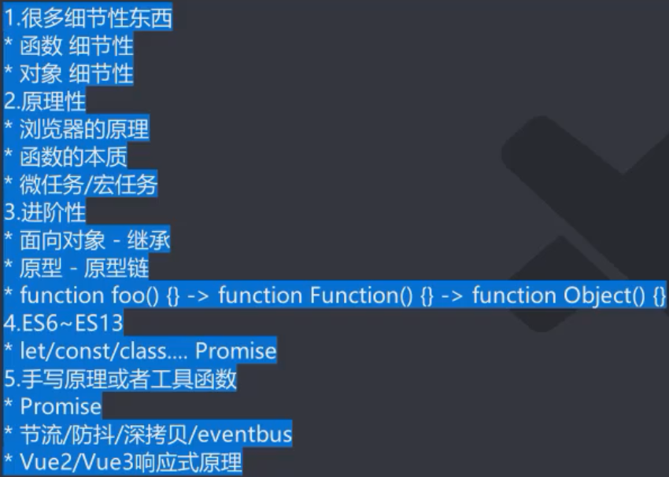
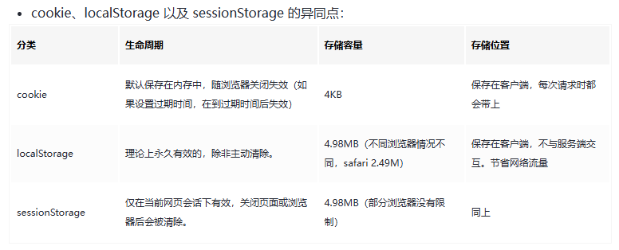

# ***细枝末节***

***JavaScript高级:***



## JavaScript函数this指向

### 1.this绑定规则


***普通函数的 `this` 在执行时绑定，而箭头函数的 `this` 在定义时绑定。***


***函数在调用时，JavaScript会默认给this绑定一个值***

***this的绑定 和 定义位置(编写的位置)没有关系***

***this的绑定 和 调用方式以及调用的位置有关系***

***this是在运行时被绑定***


#### 1.1默认绑定

```javascript
//定义函数
function foo(){ 
    console.log("foo:",this);
}
//1.直接调用
foo();//默认绑定 
//2.函数定义在对象中，但是独立调用
var obj = {
    name："why",
    bar:function(){
        console.log("bar:",this)
    }
}

var baz = obj.bar;
baz();//默认绑定

//3.高阶函数(通过传入一个参数内部再调用)
function test(fn){
    fn();
}
test(obj.bar);

//4.在严格模式下,独立调用的函数中的this指向都是undefined(开头加上“use strict”)
//独立函数调用指向windows

//2.通过对象(不指向windows)
var obj = {name:"why"};
obj.aaa = foo;
```


#### 1.2隐式绑定

```javascript
function foo(){
    console.log("foo:",this);
}

var obj = {
    bar : foo
}
//由obj发起,this与obj绑定(隐式--JS引擎内部隐式把obj与this绑定)
obj.bar();
```


#### 1.3new绑定

```javascript
//1.创建新的空对象
//2.将this指向这个空对象
//3.执行函数体中的代码
//4.没有显示返回空对象时,默认返回这个对象
function foo(){
    console.log("foo:",this)
    this.name = "Code"
}
new foo();
```


#### 1.4显式绑定(apply/call/bind)

```javascript
function foo(){
    console.log("foo:",this)
}

var obj = {
    name:"Cookie"
}

foo.call(obj)
foo.call(123)
foo.call("Code")
foo.call(undefined)
```


### 2.apply/call/bind

```javascript
//------(apply/call/bind补充)------

function fo(name,age,height){
    console.log("foo：",this)
    console.log("参数：",name,age,height)
}

//apply(数组)
//第一个参数：绑定this
//第二个参数：传入额外的实参，以数组的形式
fo.apply("apply",["Cookie",99,180])

//call(参数列表)
//第一个参数：绑定this
//参数列表：后续参数以多参数的形式传递，会作为实参
fo.call("call","GG-bond",99,160)
//JavaScript中的所有函数都可以使用call和apply方法
//如果第一个参数未指向声明默认——指向windows

//bind(了解)
// 可以将fo函数中的this绑定在obj身上 并且不将函数添加在obj上
function fk(name,age,height,address){
    console.log("fk:",this)
    console.log("Element:",name,age,height,address)
}

var obj = {
    name:"Cookie"
}
//也可以绑参数
var bar = fk.bind(obj,"Code",99,180);
bar("CN") // this -> obj
```


### 3.this绑定优先级

```javascript
		// function foo(){
        //     console.log("foo:",this)
        // }

        //显式绑定 > 隐式绑定
        // var obj = {
        //     fn:foo
        // }
        // obj.fn.apply("Cookie")

        // bind > 默认绑定
        // var bar = foo.bind("Cookie")
        // var obj = {
        //     name:"GG-bond",
        //     baz:bar
        // }
        // obj.baz()

        //new绑定 > 隐式绑定
        // var obj = {
        //     name:"Cookie",
        //     fn:function() {
        //         console.log("foo:",this)
        //         console.log("foo:",this === obj)
        //     }
        // }
        // new obj.fn()

        //new不可以和apply/call一起使用

        // new绑定 > bind绑定
        function foo() {
            console.log("foo:",this)
        }

        var bindFn = foo.bind("Cookie")
        new bindFn()

		function foo(){
            console.log("foo:",this)
        }

        var bindFn = foo.bind("GG-bond") 

        bindFn.call("Cooike")

//1.new
//2.bind
//3.apply/cal
//4.隐式绑定
//5.默认绑定
```


### 4.绑定之外的情况

```javascript
		// "use strict"
        
        // function foo(){
        //     console.log("foo:",this)
        // }

        // //在传入null或者undefined时 会使用默认绑定
        // //在严格模式下 会原封输出null和undefined
        // foo.call("Cookie")
        // foo.call(null)
        // foo.call(undefined)

        // 间接函数引用(垃圾代码)
        // var obj1 = {
        //     name:"Cookie",
        //     foo: function(){
        //         console.log("foo:",this)
        //     }
        // }
        // var obj2 = {
        //     name:"obj2"
        // }

        // obj2.foo = obj1.foo
        // obj2.foo()
```


### 5.箭头函数的使用

***箭头函数中不绑定this(箭头函数中没有this,arguments)***

***不能使用 new 构造函数***

***如果在箭头函数中调用this时，则会跳出箭头函数作用域，到全局作用域中找(默认windows)***

```javascript
        // () => {}
        setTimeout(() => {
            console.log("setTimeOut")
        },3000)

        var names = ["Cookie","GG-bond","LOL"]
        // 1.只有一个参数可以去除小括号
        names.forEach(item => {
            console.log(item)
        })
        // 2.如果函数体中只有一条执行代码{}可以省去(return除外)
        names.forEach(item => console.log(item))

        // 3.return 也可以省掉 但在箭头后的内容将全部自动return
        var numbers = [78,90,21,213]
        var filterNumbers = numbers.filter(item => item % 2 === 0)
        console.log(filterNumbers)
        //只有一行代码时,这行代码的表达式结果会作为函数的返回值默认返回
        var arrFn = () => 123
        console.log(arrFn())

        // 4.如果默认返回值是一个对象, 那么这个对象必须加()
        // ！！react 中多用 redux
        var objFn = ({name:"Cookie"})
        console.log(objFn)

        var nums = [4,5,6,7,8,9]
        var result = nums.filter(item => item % 2 === 0)
        .map(item => item * item)
        .reduce((prevValue,item) => prevValue + item) 

        console.log(result)

		//指向obj
		var obj = {
            name:"popguys",

            fo: function() {
                
                var bar = () => {
                    console.log("bar:",this)
                }
                return bar
            }
        }

        var fn = obj.fo()
        fn.apply("aaa")

		//指向windows
```


***箭头函数中没有this，apply调用无效，this会向上层作用域寻找，所以最后会绑定全局作用域中的windows***


### 6.this面试题分析

```javascript
		var name = "window"

        var person1 = {
            name:"person1",
            foo1: function(){
                console.log(this.name)
            },
            foo2: () => console.log(this.name),
            foo3: function(){
                return function(){
                    console.log(this.name)
                }
            },
            foo4: function(){
                // console.log(this)
                return () => {
                    console.log(this.name)
                }
            }
        }

        var person2 = {name:"person2"}

        person1.foo1()
        person1.foo1.call(person2)
        console.log("-----------")
        person1.foo2()
        person1.foo2.call(person2)
        console.log("-----------")
        person1.foo3()()
        person1.foo3.call(person2)()
        person1.foo3().call(person2)
        console.log("-----------")
        person1.foo4()()
        person1.foo4.call(person2)()
        person1.foo4().call(person2)
```


```javascript
		var name = "window"
		function fn(name){
            this.name = name
            this.foo1 = function(){
                console.log(this.name)
            }
            this.foo2 = () => console.log(this.name)
            this.foo3 = function(){
                return function() {
                    console.log(this.name)
                }
            }
            this.foo4 = function(){
                return () => {
                    console.log(this.name)
                }
            }
        }

        var person1 = new fn("person1")
        var person2 = new fn("person2")

        

        person1.foo1()
        person1.foo1.call(person2)
        console.log("-----------")
        person1.foo2()
        person1.foo2.call(person2)
        console.log("-----------")
        person1.foo3()()
        person1.foo3.call(person2)()
        person1.foo3().call(person2)
        console.log("-----------")
        person1.foo4()()
        person1.foo4.call(person2)()
        person1.foo4().call(person2)
```


```javascript
function person(name){
            this.name = name
            this.obj = {
                name:"obj",
                foo1: function () {
                    return function () {
                        console.log(this.name)
                    }
                },
                foo2: function() {
                    return () => {
                        console.log(this.name)
                    }
                }
            }
        }

        var person1 = new person("person1")
        var person2 = new person("person2")

        person1.obj.foo1()()
        person1.obj.foo1.call(person2)()
        person1.obj.foo1().call(person2)

        person1.obj.foo2()()
        person1.obj.foo2.call(person2)()
        person1.obj.foo2().call(person2)
```


## 浏览器渲染原理

输入 URL 后网页的请求显示过程如下：

1. **DNS 解析**：浏览器先检查本地 DNS 缓存，若没有找到对应记录，就向本地 DNS 服务器发起查询请求，将域名转换为 IP 地址。
2. **建立 TCP 连接**：浏览器与目标服务器通过三次握手建立 TCP 连接，为数据传输创建可靠通道。
3. **发送 HTTP 请求**：浏览器向服务器发送 HTTP（S）请求报文，包含请求方法、URL、协议版本等信息。
4. **服务器处理请求**：服务器接收请求后，根据请求内容进行处理，如查询数据库、调用脚本等，生成响应数据。
5. **返回 HTTP 响应**：服务器将处理结果封装成 HTTP 响应报文，包含状态码、响应头和响应体，返回给浏览器。
6. **接收并解析响应**：浏览器接收响应，先根据状态码判断请求是否成功，然后解析响应头获取相关信息，再解析响应体中的 HTML、CSS、JavaScript 等资源。
7. **渲染页面**：浏览器根据解析的 HTML 构建 DOM 树，结合 CSS 构建渲染树，计算元素的布局和样式，最后绘制出页面。
8. **关闭连接**：数据传输完成，浏览器和服务器根据情况关闭 TCP 连接 。

### 1.网页解析过程


### 2.浏览器渲染流程

在了解合成层如何提升性能之前，先简单了解下浏览器渲染页面的基本流程：

1. **构建 DOM 树和 CSSOM 树**：浏览器解析 HTML 和 CSS 代码，分别构建 DOM（文档对象模型）树和 CSSOM（CSS 对象模型）树。
2. **布局（Layout）**：结合 DOM 树和 CSSOM 树，计算每个元素在页面上的位置和大小。
3. **绘制（Paint）**：将元素的视觉样式（如颜色、边框、背景等）绘制到一个或多个位图中。
4. **合成（Compositing）**：将各个绘制好的位图按照正确的层级和位置组合成最终的页面图像显示在屏幕上。


***link元素不会阻塞DOM Tree的构建过程，但是会阻塞Render Tree的构建过程（因为Render Tree在构建时，需要对应的CSSOM Tree）***


### 3.回流和重绘解析


在 CSS 中，以下属性会形成新的合成层：

1. **3D 变换属性**：如`translate3d`、`translateZ`等。
2. **视频、画布和内联框架元素**：如`video`、`canvas`、`iframe`等。
3. **具有`will-change`属性的元素**：该属性可以提示浏览器哪些属性将要改变，从而提前进行优化。
4. **对`opacity`、`transform`、`filter`、`backdropfilter`应用了`animation`或者`transition`的元素**。
5. **具有`position: fixed`的元素**。
6. **`opacity`小于 1 的元素**。
7. **具有 CSS 滤镜属性的元素**。
8. **具有 CSS 遮罩属性的元素**。
9. **具有 CSS 混合模式属性且值不为`normal`的元素**。
10. **具有 CSS 反射属性的元素**。
11. **具有 CSS 列数属性且值不为`auto`或者具有 CSS 列宽属性且值不为`auto`的元素**。

 

### 4.合成和性能优化


#### ***合成层工作原理***

浏览器会将页面中的元素划分到不同的层中，每个层都可以独立进行绘制和处理。合成层就是这些独立的层，它们可以在 GPU（图形处理单元）上进行渲染，而不是依赖 CPU。GPU 具有强大的并行计算能力，非常适合处理图形渲染任务。

***合成层提高页面渲染性能的具体方式***

##### 1. 减少重绘和回流的影响

- **重绘（Repaint）**：当一个元素的外观发生改变，但没有影响到布局信息（如颜色、透明度变化）时，浏览器会将该元素的外观重新绘制到对应的位图上。
- **回流（Reflow）**：当 DOM 的变化影响了元素的布局信息（元素的的宽度、高度、边距等几何信息），浏览器需要重新计算元素在视口内的位置和大小，将其安放到界面中的正确位置，这个过程叫做回流。
- **合成层的作用**：如果一个元素位于单独的合成层中，当它发生重绘或回流时，只会影响该合成层本身，而不会影响到其他层。这样就避免了对整个页面进行重绘和回流，大大减少了渲染的工作量。例如，一个使用 `transform` 进行动画的元素，如果它在单独的合成层中，`transform` 变换不会触发重排和重绘，只需要在合成阶段进行处理。

##### 2. 利用 GPU 加速渲染

- CPU 在处理图形渲染任务时，往往会受到多线程调度、内存带宽等因素的限制，处理效率相对较低。而 GPU 专门设计用于处理大规模的并行计算任务，在图形渲染方面具有天然的优势。
- 合成层可以将渲染任务交给 GPU 处理。GPU 能够高效地处理纹理、变换等操作，快速完成合成层的绘制和组合。例如，在进行 3D 变换（如 `translate3d`、`rotate3d` 等）时，GPU 可以直接对合成层进行硬件加速，实现流畅的动画效果。

##### 3. 独立的层更新和组合

- 不同的合成层可以独立进行更新。当页面中的某个元素发生变化时，只需要更新对应的合成层，而不需要重新绘制整个页面。然后，浏览器可以快速地将各个更新后的合成层组合在一起，形成最终的页面图像。
- 这种独立更新和组合的方式使得浏览器能够更高效地处理页面变化，特别是在处理复杂页面和动画效果时，能够显著提升页面的响应速度和流畅度。例如，在一个包含多个动画元素的页面中，每个动画元素都可以位于独立的合成层，它们的动画可以独立运行和更新，互不干扰。


### 5.defer和async属性

#### defer:


#### async:


***AI：***

`defer`和`async`是 HTML 中`<script>`标签的两个属性，用于控制脚本的加载和执行行为。

#### 相同点

- 都是用于优化 JavaScript 文件的加载，防止阻塞 HTML 解析。
- 脚本文件都会在 HTML 解析的同时并行加载，不阻塞 HTML 的解析。

#### 不同点

- 执行顺序：
  - `defer`：脚本会在 HTML 解析完成后（即 DOM 完全构建后，但在`DOMContentLoaded`事件触发之前）执行。如果页面中有多个带有`defer`属性的脚本，它们会按照在 HTML 中出现的顺序依次执行。
  - `async`：脚本会在加载完成后立即执行，不受 HTML 解析的影响。脚本的执行时机取决于加载完成的时间，而非 HTML 解析完成的时间。多个带有`async`属性的脚本之间没有固定的执行顺序。
- 适用场景：
  - `defer`：适用于需要依赖 DOM 或其他脚本的场景，例如统计代码、广告脚本等。这些脚本必须在 DOM 完全构建后才能正确运行。
  - `async`：适用于独立运行的脚本，例如第三方统计工具、广告代码、行为分析等。这些脚本不需要依赖 DOM 或其他脚本，可以加快页面加载速度。
- 脚本依赖性：
  - `defer`：支持脚本依赖关系，保证执行顺序。
  - `async`：不支持脚本依赖关系，可能导致执行顺序错误。

#### 总结

如果脚本需要在 HTML 解析完成后运行，并且多个脚本之间存在依赖关系，建议使用`defer`；如果脚本是独立的，不依赖其他脚本或 DOM，可以使用`async`来优化加载速度。


# Javascript运行原理

### ***ES***


## 1.V8引擎

***JS引擎在执行代码之前，会在堆内存内创建一个全局对象：Global Object(GO)***

​	该对象 **所有的作用域（scope）** 都可以访问

​	内部包含 **Data，Array，String，Number，setTimeout，setInterva**l 等

​	还有一个 **window属性** 指向自己


## 2.JS执行上下文

### 组成部分

每个执行上下文主要由三部分组成：

1. **变量对象（Variable Object）**：用于存储变量和函数的定义。在全局执行上下文中，变量对象就是全局对象（在浏览器环境中是 `window` 对象）；在函数执行上下文中，变量对象是活动对象（Activation Object），它包含了函数的参数、局部变量和内部函数。
2. **作用域链（Scope Chain）**：由多个变量对象组成，用于查找变量和函数的定义。作用域链保证了变量和函数的作用域规则，当访问一个变量时，JavaScript 引擎会先在当前执行上下文的变量对象中查找，如果找不到，就会沿着作用域链向上查找，直到找到该变量或到达全局执行上下文。
3. **`this` 指针**：`this` 指针指向当前执行上下文的对象。`this` 的值在不同的执行上下文中可能不同，它取决于函数的调用方式。


### 创建阶段：

**1.创建变量对象**：初始化变量和函数的定义。变量会被初始化为 `undefined`，函数会被完整地定义。

**2.建立作用域链**：将当前执行上下文的变量对象与外层执行上下文的变量对象链接起来，形成作用域链。

**3.确定 `this` 指针的值**：根据函数的调用方式确定 `this` 指针的指向。


### 上下文类型：

**全局执行上下文**：这是最外层的执行上下文，在浏览器环境中，全局执行上下文就是 `window` 对象。全局执行上下文在程序开始时创建，直到程序结束才销毁。

**函数执行上下文**：每当调用一个函数时，就会创建一个新的函数执行上下文。函数执行上下文在函数调用结束后销毁。

**`eval` 执行上下文**：`eval` 函数可以动态执行 JavaScript 代码，每次调用 `eval` 函数时，会创建一个新的 `eval` 执行上下文。不过，由于 `eval` 存在安全风险，一般不建议使用。


## 3. 

#### 认识VO对象


## 4.函数代码执行过程

**在先前全局代码会先将函数代码解析好，在函数被调用时会创建一个新的VO对象（也叫做AO(Active Object)，会被推入执行上下文栈（堆内存）的栈顶）和函数关联，之后会执行函数中的代码先解析（函数内部中的 所创建的东西开始为undefined 还会携带arguments（有参数argument就有值，反之）），之后开始给值一一赋值，之后代码正常顺序执行**


## 5.作用域和作用域链

***函数作用域与 函数的定义位置 有关，还会受到 块级作用域 、 闭包 、`with` 语句和 `eval` 函数等因素的影响。***

### ***作用域链：***

***在函数内部，如果要访问一个变量，会首先在函数的局部作用域中查找，如果没有找到，就会向上一级作用域查找，直到全局作用域。***

```javascript
var x = 10;  // 全局变量

function outer() {
    var x = 20;  // 局部变量
    function inner() {
        console.log(x);  // 输出20，因为在局部作用域中找到了x
    }
    inner();
}

outer();
console.log(x);  // 输出10，因为在全局作用域中找到了x
```


```javascript
var message = "Global Message"

function foo(){
    var name = "foo"
    function bar(){
        console.log(name)
        function text(){
            console.log(message)
        }
        return text
    }
    return bar
}

var bar = foo()
var text = bar()
text()
```


 


# Javascript内存管理和闭包

### ***认识内存管理：***


## 1.Javascript内存管理


### V8内存管理：


## 2.*垃圾回收机制算法（面试）

***垃圾回收器会定期检查内存中的对象，找出那些不再被引用的对象，并释放它们占用的内存。***

***V8本身的优化：1.标记整理	2.分带处理	3.增量收集	4.闲时收集***

**标记清除：**


**常见的：**


## 3.闭包的概念理解

***闭包：通过作用域链***


## 4.闭包的形成过程


## 5.闭包的内存泄露


***被遗弃的内容不再使用，不进行内存释放删除被遗弃内容，导致内存堆积***

```html
<!DOCTYPE html>
<html lang="en">
<head>
    <meta charset="UTF-8">
    <meta name="viewport" content="width=device-width, initial-scale=1.0">
    <title>Document</title>
</head>
<body>
    
    <button class="create">创建</button>
    <button class="destroy">清除</button>

    <script>

        function createArray(){
            var array = new Array(1024* 1024).fill(1024)
            function generateNew() {
                console.log(array)
            }
            return generateNew
        }

        var totalArray = []

        var createBtnEl = document.querySelector(".create")
        var destroyBtnEl = document.querySelector(".destroy")

        createBtnEl.onclick = function() {
            for(var i = 0 ; i < 100 ; i ++ ){
                totalArray.push(createArray())
            }
        }
        destroyBtnEl.onclick = function() {
            totalArray = []
        }


    </script>
</body>
</html>l
```

**在浏览器中会有对应的内存优化，当AO有对象未被访问时，会将其释放**

```javascript
function foo(){
	var name = "GG"
	var age = "18"
	var height = 1.8
	return function foo1(){
        //debugger
		console.log(name,height)
	}
}

var foo1 = foo()
foo1()
```


# JavaScript增强知识

## 函数

### 1.函数属性 + arguments

***可以把函数当作一个特殊的对象（默认函数对象中已经有自己的属性了）***

***arguments不是数组(伪数组)***

***箭头函数不绑定arguments*** 


### ***2.纯函数的理解与应用（掌握）***

***理解：***


***作用与优势：***


### ***3.柯里化的理解和应用 + 剩余参数（rest）（掌握）***

***概念：***

柯里化（Currying）是一种将多参数函数转换为一系列单参数函数的技术。也就是说，一个原本接受多个参数的函数，经过柯里化后，**会变成每次只接受一个参数，并返回一个新的函数**，这个新函数继续等待接收下一个参数，直到所有参数都被接收完毕，才会执行最终的逻辑并返回结果

```javascript
		var foo = (x,y,z) => console.log(x + y + z)

        var sum = (x1,x2) => {
            return x1 + x2
        }

        //自动柯里化封装
        //递归拆解
        function hyCurrying(fn){
            function curryFn(...args){
                if(args.length >= fn.length){
                    return fn(...args)
                }
                else {
                    return function(...newArgs){
                        //递归
                         return curryFn(...args.concat(newArgs))
                    }
                }
            }
            return curryFn
        }

        var fooCurry = hyCurrying(foo)
        fooCurry(10)(20)(30)
        var sumCurry = hyCurrying(sum)
        var sum5 = sumCurry(5)
        console.log(sum5)
        console.log(sum5(10))
```

### 4.组合函数理解和应用


```javascript
function composeFn(...fns){
            var length = fns.length
            if(length <= 0)return
            //检测是否合法传入函数
            for(var i = 0 ; i < length ; i ++ ){
                var fn = fns[i];
                if(typeof fn !== "function"){
                    throw new Error(`Index position ${i} must be a function`)
                }
            }
            
            return function(...args){
                var res = fns[0].apply(this,args)
                for(var i = 1 ; i < length ; i ++ ){
                    var fn = fns[i]
                    res = fn.apply(this,[res])
                }
                return res
            }
        }
        //console.log默认会返回undefined
        var newFn = composeFn(double,pow2,console.log)
        // console.log(newFn(10))
        newFn(10)
```

### 5.with，eval的使用

**with语句：扩展一个语句的作用链（不建议使用）**

**eval语句：是一个全局函数，它可以将传入的字符串作为 JavaScript 代码进行解析和执行（不建议使用，可读性差，性能差，容易被篡改，不安全）**

```JavaScript
 var obj = {
            message:"Hello world"
        }

        //限定作用域查找
        with(obj){
            console.log(message)
        }

        var message = "Hello Javascript"
        var codeString = `var name = "JavaScript"; console.log(name); console.log(message)`
        eval(codeString)
```

### ***6.严格模式的使用(掌握)***

**认识：**严格模式（Strict Mode）是一种可以让代码以更严谨风格运行的模式。它对代码提出了更多的约束条件，有助于写出更规范、更安全的代码。以下将从开启方式、特点、优势以及局限性等方面详细介绍严格模式。


**严格模式对Javascript的语义限制：**

1.会通过 抛出错误 来消除一些原有的 静默（silent）错误

2.会让JS引擎在执行代码时得到跟多优化

3.禁用在ECMAScript未来版本可能会定义的一些语法


**开启：**

可以在js文件中开启（全局）

可以在某一个函数中开启


**严格模式限制:**

1.无法意外创建全局变量

2.静默错误(有错误但不报错)，删除不可删除属性

3.函数参 数不能有相同命名

4.不允许0的8进制语法

5.严格模式下，不允许随便用with

6.eval不再为上层创建变量

7.this绑定不会默认转成对象


## 对象

### 1.Object.defineProperty

***可以控制对象属性***

```javascript
Object.defineProperty(obj,prop,descriptor)
//obj 对象
//prop 要定义或者修改的属性的名称 或 Symbol
//descriptor要定义或者修改的属性描述符
```

### 2.数据属性描述符

**Configurable：**表示属性是否可以通过delete删除属性，是否可以修改它的特性，或者是否可以将它修改为存取属性描述符

***特性：***

**1.在初始定义对象时configurable属性默认为true**

**2.当通过属性描述符(例：defineProperty)方法定义属性时,该属性的configurable默认为false**

**Enurmerable：**表示属性是否可以通过 **for-in** 或者 **Object.key()** 返回该属性

***特性：***同上

**Writable:**表示是否可以修改属性的值

***特性：***同上

```javascript
var obj = {
            name: "Cookie",
            age:19
        }

        Object.defineProperty(obj,"name",{
            configurable:false,
        })

        delete obj.name
        console.log(obj)
        //当通过defineProperty方法定义属性时,该属性的configurable默认为false
        Object.defineProperty(obj,"address",{})
        delete obj.address
        console.log(obj)

        console.log(Object.keys(obj))

        Object.defineProperty(obj,"name",{
            writable:false,
            value:"Popguys"
        })

        obj.name = "Man"
        console.log(obj.name)
```


### ***3.存取属性描述符（掌握）***

**Configurable：**与数据属性描述符一致
**Enumerable：**同上

**Get:**获取属性时会执行的函数,默认为undefined

**Set:**设置属性时会执行的函数,默认为undefined

```javascript
var obj = {
            name: "Cookie"
        }

        var _name = ""
        Object.defineProperty(obj,"name",{
            configurable:true,
            enumerable:false,
            set:function(value){
                console.log("Set方法被调用",value)
                _name = value
            },
            get:function(){
                console.log("Get方法被调用",_name)
                return _name
            }
        })

        obj.name = "Popguys"
        obj.name = "Supermonkeyguys"
        obj.name = "Whatup2021"

        console.log(obj.name)
```


### 4.Object.defineProperties

原本每次修改一个属性就得使用一次Object.defineProperty比较麻烦，后续版本中推出了  ***Object.defineProperties***  可以同时对多个属性操作

```javascript
var obj = {
            name:"Cookie",
            age:19,
            home:"HN"
        }

        Object.defineProperties(obj,{
            name:{
                writable:true,
                value:"Popguys"
            },
            age:{
                get:function(){
                    return this.age
                }
            }
        })
```

**注意：**如果一个属性配置了 `getter` 和 `setter` （访问器属性），就不能再同时指定 `value` 和 `writable` 。因为访问器属性是通过函数来控制属性的获取和设置，和直接指定值以及可写性的常规属性是不同的定义方式。

```javascript
var obj = {
            name:"Cookie",
            age:19,
            home:"HN"
        }

        var _age = 19
        Object.defineProperties(obj,{
            name:{
                writable:true,
                value:"Popguys"
            },
            age:{
                // writable:true,
                set:function(value){
                    _age = value;
                },
                get:function(){
                    console.log(_age)
                    return _age;
                }
            }
        })

        obj.age = 21
        console.log(obj.age)
```


### 5.对象的其他方法补充

**获取对象属性描述符：**

getOwnPropertyDescriptor

getOwnPropertyDescriptors

```javascript
console.log(Object.getOwnPropertyDescriptor(obj,"name"))
console.log(Object.getOwnPropertyDescriptors(obj))
```

**禁止对象扩展新属性:** ***preventExtensions***

给一个对象添加新的属性会失败

```javascript
Object.preventExtensions(obj)
```

**密封对象，不允许配置和删除属性：*seal***

实际上是调用preventExtensions

并且将现有属性configurable：false

```javascript
Object.seal(obj)
```

**冻结对象，不允许修改现有属性：*freeze***

实际上是调用seal

并且将现有属性的writable：false


# ES5 + ES6

## Javascript ES5中实现继承

***任何对象都有自己的原型（隐式原型）***

### *1.对象和函数的原型（掌握）*

Javascript当中每个对象都有一个特殊的内置属性[[prototype]]，这个特殊的对象可以指向另外一个对象

**获取方式：**

```javascript
var pt = Object.getPrototypeOf(obj)
var pt1 = obj.__proto__//早期浏览器添加，存在一定兼容问题，虽然是非标准，但广泛支持
```

**有什么用？**

当通过引用对象的***属性key来获取一个value***时，会***触发[[Get]]***操作

操作时会***首先检查对象是否有有对应属性***，如果有的话就直接使用

如果没有，***那则会访问对象[[prototype]]内置属性指向的对象上的属性***


**所有函数都有一个prototype的属性**

```javascript
//将函数看成是一个普通对象时，他是具备__proto__(隐式原型)
console.log(foo.__proto__)//输出：ƒ () { [native code] }
console.log(Object.getPrototypeOf(foo))//输出：ƒ () { [native code] }

//将函数看成一个函数时,其时具备prototype的(显式原型)
//作用：用来构建对象时,给对象设置隐式原型
console.log(foo.prototype)
```


#### ***共享机制（掌握）：***

- **好处**：方便统一管理和维护方法，一处修改，所有实例都能体现变化；也减少代码冗余，让代码结构更清晰，节省空间。

一种设计模式

当多个对象  ***有多个共同的方法（函数）或值***  时，我们可以将它放到构造函数对象的显示原型(prototype)

由**构造函数创建出来的所有对象**，都会共享这些**属性**（方法或者值）

```javascript
		function Student(name,age,dot){
            this.name = name,
            this.age = age,
            this.dot = dot
        }

        Student.prototype.playing = function() {
            console.log(this.name + " is playing");
        }
        Student.prototype.eating = function() {
            console.log(this.name + " is eating");
        }
        
        var stu1 = new Student("Cookie",19,100)
        var stu2 = new Student("Popguys",20,100)

        stu1.playing();
        stu2.eating();
```


***疑问：***

**1.什么是函数的显式原型**

**2.函数原型与对象原型的区别**

**3.函数原型的作用**

通过new操作创建对象时，将这个显式原型赋值给创建出来对象的隐式原型


### ***2.new，constructor（构造器）（掌握）***

**new操作：**

1.在内存中创建一个新的空对象

2.这个对象内部的[[prototype]]属性会被赋值为该构造函数的prototype属性

```javascript
function foo(){
	return 1
}
var newFoo = new foo()
//相当以上操作
var f = {}
p.__proto__ = foo.prototype
```

2.将空对象赋值给this

3.将函数的显示原型赋值给这个对象作为它的隐式原型

4.执行函数中代码

5.将这个对象默认返回


**Constructor:**

事实上原型对象上面是有一个属性的：consrutor

默认情况下原型上都会添加一个属性叫做constructor，这个constrcutor指向当前函数对象，如下图：


**构造函数创建对象的内存表现：**


```Javascript
	function Person(name,age){
            this.name = name,
            this.age = age
        }

        Person.prototype.message = "Hello World"
        Person.prototype.online = function(){
            console.log(this.name + " is online")
        }

        var p1 = new Person("Cookie",19)
        var p2 = new Person("Popguys",20)

        // p1.address = "China"
        Person.prototype.address = "China"
        p2.count = 10

        p1.online()
        console.log(p1.address)
        console.log(p1.count)
        console.log(p2.address)
        console.log(p2.count)

```


#### ***函数原型对象赋值新对象（掌握）：***

 **第一种添加constructor的方法会使constructor的enumerable为true(默认为false),使其可枚举**

**为尽可能还原constructor原先浏览器的预设，我们可以通过Object.defineProperty的方法来添加**

```javascript
		function Person(){

        }

        console.log(Person.prototype)

        Person.prototype = {
            message: "Hello Stranger",
            info:{
                name:"Cookie",
                age:19
            },
            online : function(){
                console.log(this.info.name + " is online")
            },
            play : function(){},
            constructor: Person//第一种方法---也行,但不太严谨
        }
		//第二种方法---推荐添加constructor属性的方法
	Object.defineProperty(Person.prototype,"constructor",{
    	enumerable:false,
        configurable:true,
        writable:true,
        value:Person
    })
        var p1 = new Person()
        console.log(p1.info)

        p1.online()
```


### 3.原型链的查找顺序


**面向对象的三大特性分析：封装，继承，多态**

**封装：前面将属性和方法封装到一个类中，可以称之为封装的过程**

**继承（掌握）：继承是面向对象中非常重要的，不仅仅可以减少重复代码的数量，也是多态的前提（纯面向对象中）**

**多态 （继承是多态的前提）：不同的对象在执行时表现出不同的形态**

**继承：**

继承可以帮助我们将**重复的代码和逻辑**抽取到父类中，子类只需要直接继承过来使用即可

**原型链**


当从一个对象获取属性，如果当前对象中没有获取到就会去它的原型上获取

```javascript
		var obj = {
            name:"Cookie",
            age:18
        }
        obj.__proto__ = { 
            // message:"Hello 1"
        }
        obj.__proto__.__proto__ = {
            message:"Hello 2"
        }
        console.log(obj.message)
```

### ***4.原型链的继承（掌握）：***

#### ***利用原型链实现继承（掌握）：***

```javascript
	function Person(name,age){
            this.name = name,
            this.age = age
        }

        Person.prototype.online = function() {
            console.log("Online~")
        }

        function Student(name,age,sno,score){
            this.name = name,
            this.age = age,
            this.sno = sno,
            this.score = score
        }

        // 方式一：父类原型直接赋值给子类原型
        //缺点：父类和子类共享一个原型对象，修改一个，另外一个也与之修改
        Student.prototype = Person.prototype

        //方式二：创建一个父类的实例对象---实现效果有点像牵线搭桥
		//方案三：
		//Object.create(x)方法会创建一个新对象并把这个对象的隐式原型绑定在x的显示原型上
		//var obj = Object.create(Person.prototype)
        //Student.prototype = obj
        //方案二：
		//中间借用函数,而非对象的方法(可以不使用__proto__,因为__proto__存在一定兼容问题，此方案可以避免兼容性问题)
        // function f(){}
        // f.prototype = Person.prototype
        // Student.prototype = new f()
		//方案一：借用对象（使用隐式原型__proto__）
        var p = new Person("Cookie",19)
        Student.prototype = p

        Student.prototype.studying = function(){
            console.log("studying")
        }
```

方法一，二：


继承对象的内存创建图：


### ***5.借用构造函数继承（掌握）：***

#### ***借用构造函数实现继承（Constructor Stealing）（掌握）：***

**组合继承，既借用原型链也借用构造函数**

**因为函数可以在任意时刻被调用，通过apply或者call方法在新创建的对象上执行构造函数**

- **优点**：能够实现实例属性（方法）的继承，避免了引用类型的属性被所有实例共享。

```javascript
	function Person(name,age){
            this.name = name,
            this.age = age
        }

        Person.prototype.online = function() {
            console.log("Online~")
        }


	function Student(name,age,sno){
		Person.call(this,name,age)
		this.sno = sno
	}
```

**组合继承问题：**

1.组合继承最大的问题就是无论在什么情况下，都会**调用两次父类结构函数**(第一次在创建子类原型的时候，第二次在子类构造函数内部（每次创建子类实例的时候）)

2.**所有子类实例事实上会拥有两份父类属性**（第一份在当前的实例自己里面（Person本身），第二份在子类对应的原型对象中（Person.__proto__中））

### ***6.寄生组合实现继承（掌握）***

```javascript
//单写一份文件引用
function createObject(type){
    //借用对象
    //var newObj = {};
    //Object.setPrototype(newObj,type);
    //return newObj;
    //借用构造函数
    function f(){};
    f.prototype = type;
    return new f();
}

function inherit(Subtype,Supertype){
    Subtype.prototype = createObject(Supertype.prototype);
    Object.defineProperty(Subtype.prototype,"constructor",{
        enumerable:false,
        configurable:true,
        writable:true,
        value:Subtype
    })
}

function Person(name,age,address){
            this.name = name,
            this.age = age,
            this.address = address
        };

        Person.prototype.online = function(){
            console.log(this.name + " is online");
        }
        Person.prototype.leaving = function(){
            console.log(this.name + " is leaving");
        }
        Person.prototype.from = function(){
            console.log(this.name + " is from " + this.address);
        }

        function Student(name,age,address,score,classNum){
            Person.call(this,name,age,address);
            this.score = score,
            this.classNum = classNum
        }

        inherit(Student,Person);
        Student.prototype.learning = function(){
            console.log(this.name + " is learning");
        }

        var stu1 = new Student("Cookie",19,"HN");

        stu1.learning();
        stu1.online();
        stu1.from();
```


### ***7.补充：***

#### ***Object类是所有类的父类（掌握）：***

**任何类终将继承自Object(爹)**


```javascript
        function createObject(type){
            function f(){};
            f.prototype = type;
            return new f();
        }

        function inherit(Subtype,Supertype){
            Subtype.prototype = createObject(Supertype.prototype);
            Object.defineProperty(Subtype.prototype,"constructor",{
                enumerable:false,
                configurable:true,
                writable:true,
                value:Subtype
            })
        }

		function Person(){};
        function Student(){};
        function Teacher(){};

        inherit(Student,Person);
        console.log(Person.prototype.__proto__ === Object.prototype);

        Object.prototype.message = "Hello Lec";

        var stu = new Student();
        console.log(stu.message);

        console.log(Object.prototype);
        console.log(stu.toString);

		function foo(){};
		console.log(foo.message);
	
		var obj = {};
        console.log(obj.__proto__);
```


```javascript
//后续新方法存在一定兼容问题
//原型继承
Object.setPrototypeOf(Subtype.prototype,Supertype.prototype)
```


## Javascript ES6中实现继承

### 1.对象的方法补充

- **`instanceof`**：检查对象的原型链中是否包含某个构造函数的 `prototype` 属性。比如 `A instanceof B` ，是看 `A` 的原型链上是否能找到 `B.prototype` 。
- **`isPrototypeOf`**：直接检查一个对象是否在另一个对象的原型链上。例如 `C.prototype.isPrototypeOf(D)` ，就是判断 `C.prototype` 是否在 `D` 的原型链中 。

```javascript
function createObject(type){
    function f(){};
    f.prototype = type;
    return new f();
}

function inherit(Subtype,Supertype){
    //后续新方法存在一定兼容问题
    // Object.setPrototypeOf(Subtype.prototype,Supertype.prototype);
    Subtype.prototype = createObject(Supertype.prototype);
    Object.defineProperty(Subtype.prototype,"constructor",{
        enumerable:false,
        configurable:true,
        writable:true,
        value:Subtype
    })
}

var obj = {
            name:"Cookie",
            age:19
        } 

        var info = createObject(obj);
        info.address = "HN";
        info.intro = "HELLO";

        //hasOwnProperty方法
        console.log(info.hasOwnProperty("name"))//false 在当前对象上查找
        //in方法
        console.log("name" in info);//true 在原型和对象中查找
        
        console.log(info.hasOwnProperty("address"))
        console.log("address" in info);
        
        //for in 方法 和in查找相同
        for(var Element in info){
            console.log(Element);
        }

        //instanceof
        //用于检测构造函数(Person,Student类)的prototype
        //是否出现在某个实例对象的原型链上
        //判断对象与构造函数之间的关系
        function Person(){};
        function Student(){};
        inherit(Student,Person)

        var stu = new Student();
        console.log(stu instanceof Student);
        console.log(stu instanceof Person);
        console.log(stu instanceof Object);
        console.log(stu instanceof Array);
        
        console.log("-------------")
        //isPrototypeOf
        //用于检测某个对象, 是否出现在某个实例对象的原型链上
        //判断对象与对象之间的继承
        console.log(Student.prototype.isPrototypeOf(stu));
        console.log(Person.prototype.isPrototypeOf(stu));
        console.log(Object.prototype.isPrototypeOf(Person));
```

### 2.原型继承关系图

***函数本身也是对象***


### 3.class方式定义类

#### ***构造函数的类方法（掌握）：***

```javascript
function Person(name,age){
            this.name = name,
            this.age = age
        };

        //添加Person原型上的方法也称为 实例方法(只能通过实例调用)
        Person.prototype.online = function(){
            console.log(this.name + " is online");
        }
        Person.prototype.leaving = function(){
            console.log(this.name + " is leaving");
        }

        //添加在对象本身的方法称为 类方法
        var names = ["Cookie" , "Popguys" , "Supermonkeyguys"];
        Person.randomPerson = function(){
            var randName = names[Math.floor(Math.random() * names.length)];
            var randAge = Math.floor(Math.random() * 100);
            return new Person(randName,randAge);
        }

        //实例对象
        var  p1 = new Person("Popguys",18);
        p1.online();

        var p = Person.randomPerson();
        console.log(p);
```


#### ***class的定义类（掌握）:***

```javascript
		//ES5中定义类
        //function Person() {}
        //ES6中定义类
        //{key:value} -> 对象
        //{表达式} -> 代码块
        //{} -> 类的结构
        class Person{

        }
        var p1 = new Person();
        console.log(p1);
        //另一种定义方法:表达式(了解)
        var Student = class{

        }
        var foo = function(){

        }
        var stu1 = new Student();
        console.log(stu1);
```


#### ***class类中定义构造方法和实例方法（掌握）***

```javascript
		//高内聚低耦合
        class Person {
            //类中的构造函数
            //当我们通过new关键字调用一个Person类时, 默认调用class中的constructor方法
            constructor(name,age){
                this.name = name;
                this.age = age;
            }

            //实例方法
            //本质上是Person.prototype
            online() {
                console.log(this.name + " is online");
            }
            leaving() {
                console.log(this.name + " is leaving");
            }
        }

        var p1 = new Person("Cookie",19);

        console.log(p1.name,p1.age);
        p1.online();
        p1.leaving();
```


#### ***类和构造函数的异同（掌握）***

1.构造函数可以当作一个普通函数使用，而class定义的类则不能作为一个普通的函数进行调用


**类的构造函数**

1.每个类可以有一个自己的构造函数（方法），其是固定的为（constructor）

2.使用new操作符时，操作一个类时会调用这个类的constructor

3.每个类只能有一个constructor，如果包含多个，则会抛出异常


#### ***new操作类时的具体操作（掌握）***

1.在内存中创建一个空对象

2.这个对象内部的[[prototype]]属性会被赋值为该类的prototype属性

3.构造函数内部的this，会指向创建出来的新对象

4.执行构造函数的内部代码（函数代码）

5.如果构造函数没有返回非空对象，则返回创建出来的新对象


**类和访问器的编写**

```javascript
var obj = {
            name:"GG-bond"
        }
        //对象访问器定义(监听某个属性)
        //方式一：
        Object.defineProperty(obj,"name",{
            configurable:true,
            enumerable:true,
            set:function() {

            },
            get:function() {

            }
        })

        // 方式二
        var obj1 = {
            name:"Cookie",
            //setter方法
            set name(value){
                this.name = value
            },
            //getter方法
            get name(){
                return this.name
            }
        }

        class Person {
            //程序员之间的约定, 以_开头的属性和方法, 是不在外界访问的
            constructor(name,age){
                this._name = name
            }

            set name(value) {
                console.log("设置name")
                this._name = value
            }

            get name() {
                console.log("获取name")
                return this._name
            }
        }

        var p1 = new Person("Cookie",19);
        p1.name = "Popguys"
        console.log(p1.name)

        var p2 = new Person("GG-bond",19);
        p2.name = "tuang tuang tuang"
        console.log(p2.name)

        //应用场景
        class Hunman{
            constructor(x,y,height,weight){
                this.x = x;
                this.y = y;
                this.height = height;
                this.weight = weight;
            }
            get position(){
                return {x:this.x,y:this.y}
            }
            get size(){
                return {height:this.height,weight:this.weight}
            }
        }

        var h1 = new Hunman(90,90,100,120);
        console.log(h1.position);
        console.log(h1.size);
```


#### ***类的静态方法（掌握）：***

**静态函数中的 this 绑定到定义该静态函数的类**

**在继承情况下，this会指向调用该静态函数的子类**

```javascript
function Person(name,age){
            this.name = name,
            this.age = age
        };

        //添加Person原型上的方法也称为 实例方法(只能通过实例调用)
        Person.prototype.online = function(){
            console.log(this.name + " is online");
        }
        Person.prototype.leaving = function(){
            console.log(this.name + " is leaving");
        }

        //添加在对象本身的方法称为 类方法(静态方法)
        var names = ["Cookie" , "Popguys" , "Supermonkeyguys"];
        Person.randomPerson = function(){
            var randName = names[Math.floor(Math.random() * names.length)];
            var randAge = Math.floor(Math.random() * 100);
            return new Person(randName,randAge);
        }

        //实例对象
        var  p1 = new Person("Popguys",18);
        p1.online();

        var p = Person.randomPerson();
        console.log(p);

        class Human{
            constructor(name,age){
                this.name = name;
                this.age = age;
            }
            //实例方法(本质上是添加在原型上)
            moving(){
                console.log(this.name + " is moving");
            }
            //this绑定->与调用相关
            //静态方法只能通过类来调用
            static randomPerson(){
                console.log(this);//指向Human
                var randomName = names[Math.floor(Math.random() * names.length)];
                var randomAge = Math.floor(Math.random() * 100);
                return new this(randomName,randomAge);//与下面写法效果相同，推荐上面的写法
                // return new Hunman(randomName,randomAge);
            }
        }

        var h1 = new Human("Cookie",20);
        h1.moving();
        // h1.randomPerson(); 静态方法不可通过实例调用
        console.log(Human.randomPerson());
```


### 4.extend实现继承  

```javascript
class Person{
            constructor(name,age,address){
                this.name = name;
                this.age = age;
                this.address = address;
            }

            Greet(){
                console.log(`Hello , I am ${this.name}`);
            }
            sayBye(stanger){
                consoele.log(`Goodbye,see you next time ${stanger.name}`);
            }
        }

        class Student extends Person {
            constructor(name,age,address,score){
                super(name,age,address);
                this.score = score;
            }

            study(){
                console.log(this.name + " is studying");
            }
        }

        var stu1 = new Student("Cookie",19,"HN",100);
        stu1.Greet();
```


**super关键字**

可以执行super.method(...)来调用父类

可以执行super(...)来调用一个父类的constructor（只能在constructor中使用）

**注意：在子（派生）类的构造函数中使用this或者返回默认对象之前，必须先通过super调用父类的构造函数**

**使用位置：1.子类的构造函数，2.实例方法，3.静态方法**

**对父类函数重写**

```javascript
class Animal { 
    constructor(name,age){
        this.name = name;
        this.age = age;
    }
	running() {
        console.log("running");
    }
    eating() {
        console.log("eating");
    }
    static sleep() {
        console.log("static animal sleep");
    }
}

class Dog extends Animal {
    constructor(name,age,weight){
        super(name,age);
        this.weight = weight;
    }
    running() {
        console.log(dog);
        super.running();
    }
    static sleep() {
        console.log("dog");
    }
}

var dog = new Dog("Buls",7,91);
dog.running();
Dog.sleep();
```


**继承内置类**

不仅仅可以继承自定义的类，还可以继承内置类（例如：Array等），主要使用目的是对内置类功能进行扩展

```javascript
//创建新类继承父类再扩展
class HYArray extends Array {
	get lastItem() {
        return this[this.length - 1];
    }
    get firstItem(){
        return this[0];
    }
}

var arr = new HYArray(10,20,30);
console.log(arr);
console.log(arr.firstItem);
console.log(arr.lastItem);
//直接对原类扩展
Array.prototype.lastItem = funtion() {
    return this[this.length - 1];
}
```


类的混入

JS只支持单继承，只能有一个父类

```javascript
function mixClass1(baseClass){
            return class extends baseClass {
                flying() {
                    console.log("flying");
                }
            }
        }

        function mixClass2(baseClass){
            return class extends baseClass {
                running() {
                    console.log("running");
                }
            }
        }

        class Animal{

        }

        var bd = mixClass2(mixClass1(Animal));
        var bird = new bd();
        bird.flying();

        class Bird extends mixClass2(mixClass1(Animal)) {

        }

        var birdp = new Bird();
        birdp.running();
```


### 5.Babel的ES6转ES5

***[深入理解class和extends原理](https://juejin.cn/post/7001025002287923207)***


### 6.面向对象多态理解

**继承是多态的前提**

[***将 “不变的事物” 与 “可能改变的事物” Take apart***](https://segmentfault.com/a/1190000017452120)

**为不同数据类型实体，提供统一接口**

**不同的数据类型进行同一个操作，表现出不同的行为**

```Javascript
class Shape {
            getArea() {};
        }

        class Rectangle extends Shape {
            constructor(width,height){
                super();
                this.width = width;
                this.height = height;
            }
            
            getArea() {
                return this.width * this.height;
            }
        }

        class Cricle extends Shape {
            constructor(radius){
                super();
                this.radius = radius;
            }

            getArea() {
                return this.radius * this.radius * Math.PI;
            } 
        }

        var rect1 = new Rectangle(100,200);
        var cric1 = new Cricle(100);
        console.log(rect1.getArea());
        console.log(cric1.getArea());

        function getShapeArea(shape) {
            console.log(shape.getArea())
        }

        getShapeArea(cric1);
```


### 7.ES6对象的增强

**字面量增强（语法糖）**

```javascript
var name = "Cookie";
        var age = 19;

        var key = "address" + "city";

        var obj = {
            //属性的增强
            name, //本质上是name:name
            age,  //age:age
            //注意箭头函数不绑定this
            eating: () => {
                console.log(this);
            },
            running: function() {
                console.log(this);
            },
            //方法的增强（非箭头函数）写法与类的有些相似
            swimming() {
                console.log(this);
            },
            //计算属性名
            [key]: "HN" //address city
        }

        obj.running();
        obj.eating();
        obj.swimming();

        console.log(obj.addresscity);
```


***数组和对象的解构以及应用（掌握）***

```javascript
var names = ["Cookie","Popguys","Supermonkeyguys",undefined];
        //基本使用
        // var [name1, name2, name3] = names;
        // console.log(name1,name2,name3);

        //严格顺序
        // var [name1, ,name3] = names;
        // console.log(name1,name3);

        //剩余参数解构
        // var [name1,name2,...restName] = names;
        // console.log(name1,name2,restName);

        //默认值 当数组内元素为undefined时, 可以在解构时进行赋值
        //如果已经有初始值, 再进行赋值操作则无效
        // var [name1, name2, name3, name4 = "GG-bond"] = names;
        // console.log(name1,name2,name3,name4);

        var obj = {name:"Cookie",age:19,address:"HN"};
        // var {name,age,address} = obj; //解构变量名需和对象内部key名相同
        // console.log(name,age,address)

        //对象解构没有顺序, 而是根据key
        // var {age,address,name} = obj;
        // console.log(age,address,name);

        //对变量重命名
        // var {name:myName,age:myAge,address:myAddress} = obj;
        // console.log(myName,myAge,myAddress)//新变量

        //赋值规则和数组相同
        // var {name:myName,age:myAge,address:myAddress = "Dingan"} = obj;
        // console.log(myName,myAge,myAddress);

        //剩余参数接受
        // var {name,...restObj} = obj;
        // console.log(name,restObj);
```


***函数对象的原型和Function的关系（掌握）:***

```javascript
		function foo(name,age){
            console.log(this,name,age);
        };
        //对象中的某些属性和方法是来自Function.prototype
        console.log(foo.__proto__ === Function.prototype); //true

        foo.apply("Cookie",["Popguys",19]);
        console.log(Function.prototype.call);
        console.log(Function.prototype.apply);
        console.log(Function.prototype.apply === foo.apply);

        Function.prototype.info = "Hello my friend!";
        console.log(foo.info);
        Function.prototype.bar = function() {
            console.log("bar function excution");
        }

        foo.bar();
```


***手写apply-call函数实现和抽取封装（掌握）：***

```Javascript
		function foo(name,age){
            console.log(this,name,age);
        };

        //封装
        function excuFn(thisArg,otherArgs,fn){
            //获取thisArg, 并且确保是一个对象类型
            thisArg = (thisArg === null || thisArg === undefined) ? window : Object(thisArg);

            Object.defineProperty(thisArg,"fn", {
                enumerable:false,
                configurable:true,
                value: fn
            })
            //利用隐式绑定
            thisArg.fn(...otherArgs);

            delete thisArg.fn;
        }

        Function.prototype.hyApply = function(thisArg,otherArgs) {
            excuFn(thisArg,otherArgs,this);
        }
        Function.prototype.hyCall = function(thisArg,...otherArgs) {
            excuFn(thisArg,otherArgs,this);
        }

        var obj = {name:"CC"};

        foo.hyApply("GG",["Cookie",19]);
        foo.hyCall(obj,"Popguys",19);
        foo.hyApply(undefined,["Supermonkeyguys",20]);
        foo.hyCall(null,"GG-bond",19);
```


***bind（掌握）：***

```javascript
function foo(name,age,height,address){
            console.log(this,name,age,height,address);
        };

        Function.prototype.hyBind = function(thisArg,...otherArgs){
            thisArg = (thisArg === null || thisArg === undefined)? window : Object(thisArg);
            Object.defineProperty(thisArg,"fn", {
                enumerable: false,
                configurable:true,
                writabe:false,
                value:this
            })
            
            return (...newArgs) => {
                var allArgs = otherArgs.concat(newArgs);
                // var allArgs = [...otherArgs,...newArgs];
                thisArg.fn(...allArgs);
                //不delete的reason
                //在后续返回新函数要调用
            }
        }

        var newFoo = foo.hyBind("CC","Cookie",19);
        newFoo(1.8,"海南省");
```


# ES6~ES13新特性

## ES6

### let-const

#### **基本使用和注意事项(掌握)**

**let用法与var基本无异，let，const无作用域提升**

**const保存的数据一旦被赋值，就不可更改但赋值如果是引用类型，则可以通过引用对象找到对应的对象来修改对象内容**

```javascript
let name = "Cookie";
name = "Supermonkeyguys";

const age = 20;
//age = 31; //错误
const info = {
	name:"popguys",
	age:20
}

//info = {}; //错误
info.age = 21;
```

**var的陷阱**

```javascript
var x = 10;
function foo(){
	console.log(x);//undefined
	var x = 100;
}

foo();
```

**let/const没有作用域提升和暂时性死区**

var声明变量有作用域提升

**在执行上下文内词法环境记录被创建之初，变量在此时就会被创建出来了，但是此时是处于不可访问状态（暂时性死区TDZ），所以let/const不能说是有作用域提升的（wiki百科，变量需要能被访问到才能说是租用与提升：同var）**

```javascript
console.log(a); //undefined TDZ-b,c
console.log(b);	//TDZ-b,c
console.log(c);	//TDZ-b,c
var a = 10; //TDZ-b,c
let b = 20;	//TDZ-c
const c = 30;
```

#### **块级作用域**

在ES5之前，只有全局和函数会形成自己的作用域

**但在ES6之后，let/const/function/class声明的变量都会具有块级作用域**

**函数虽然拥有块级作用域，但是外部依旧可以访问**（引擎内部会对函数的声明进行特殊处理，可以像var一样在外访问）

```javascript

{
	let name = "Cookie";
    let age = "19";
	const ID = 666;
    class Person{};
    function foo(){
        console.log(name);
    }
}

//console.log(name) //报错undefined
//let stu = new Person() //报错undefined
foo();
//函数 foo() 虽然定义在块内，但函数作用域可以捕获外层的块级变量（闭包特性）
//因此 foo() 内部能正常访问 name，执行时会输出 "Cookie" 
```


#### **let/cosnt块级作用域应用场景**

**词法环境会记录每次函数内部关联到的值**


```html
 <button>Button</button>
    <button>Button</button>
    <button>Button</button>
    <button>Button</button>

    <script>

        const buttonElements = document.querySelectorAll('button');
        //闭包变体方案，利用DOM对象属性存储数据
        // for(var i = 0 ; i < buttonElements.length ; i++ ){
        //     const btEl = buttonElements[i];
        //     btEl.index = i;
            
        //     btEl.onclick = function(){
        //         console.log(`I am button ${this.index}`);
        //     }
        // }
		//块级作用域 + 闭包捕获i
        for(let i = 0 ; i < buttonElements.length ; i ++ ){
            const btEl = buttonElements[i];
            btEl.onclick = function(){
                console.log(`I am button ${i}`);
            }
        }


    </script>
```


#### let-const-var在开发中的选择（掌握）


### 模板字符串（掌握）

#### ***标签模板字符串的用法和应用（掌握）***

```javascript
//ES6之前
const name = "Cookie";
const age = 19;
const height = 1.8;
const info = "My name is" + name + ", age is " + age;

//ES6之后
const info1 = `My name is ${name}, age is ${age}`;

function foo(...args){
    console.log("arguments：${arg}");
}

//foo('模板字符串',name,age,height);
foo`My name is ${name}, age is ${age}, height is ${height}`;
//模板字符串被拆分，第一个元素是数组，是被模板字符串拆分的字符串组合
//后面元素是模板块符串传入内容
```

#### ***默认参数的用法和注意事项（掌握）***

**默认参数不会对null进行处理**

具体使用根据实际需求(可能不需要对null进行处理)

**语法规范：给默认参数的参数写在最后面，但在剩余参数之前（参数匹配数据顺序）**

**tips:**

有默认参数的形参**不会计入arguments的length之内**（并且后面所有参数都不会计算在length之内）

```javascript
function foo1(arg1 = 10,arg2 = 20){
	//除默认参数之外的方法一
    //arg1 = (arg1 === null || arg1 === undefined) ? 10 : arg1; 
    //arg2 = (arg2 === null || arg2 === undefined) ? 20 : arg2;
    //方法二
    //arg1 = arg1 ?? 10;
    //arg2 = arg2 ?? 20;
    console.log(arg1,arg2);
}

foo();
foo("","");
foo(false,true);
```


#### ***默认参数和对象解构的结合（掌握）***

```javascript
function foo({name = "None" , age = 0 } = {}){
	console.log(name,age);
}

foo();
```


#### ***箭头函数的额外强调（掌握）***

箭头函数**没有显示原型prototype**，不能够作为构造函数来使用new对象

箭头函数**不绑定this，arguments，super参数** 

```javascript
let foo = () => {};

const f = new foo() //报错
```


#### ***展开语法的基本使用（掌握）***

使用场景：

**函数调用**

```javascript
function foo(arg1,arg2,...rest) {}
const names = ["Cookie","Popguys","GG-bond"];
foo(...names);
```

**数组构建**

```javascript
var names1 = ["Cookie","Popguys"];
const names = [...names1,"GG-bond"];
```

**构建对象字面量**

```javascript
const obj = {
	naem:"Cookie",
	age:19
}

const info = {
	...obj,
	address:"HN",
	id:4399
}
```


### 对象的引用赋值-浅拷贝-深拷贝（掌握） 

#### **引用赋值**：

**在Javascript中，当把一个对象赋值给变量时，实际上实在赋值该对象在内存中的引用，而不是创建一个新的副本**

```javascript
const obj = {
	name："Cookie",
    age:18,
    height:1.8
}

const info = obj;
//在info中修改值时也会修改obj
//两个值共有一个共同的指针指向堆内存
```

#### **浅拷贝（Shallow Copy）：**

**概念：**

**只复制对象的第一层属性**

**对于基本类型（字符串，数字等）：复制值**

**对于引用类型（对象，数组等）：复制引用（内存地址）**

```javascript
	//**利用展开运算符**
	//此时拷贝会在内存中开辟一个新的空间存储info，创建一个新的副本
	//而不像先前两个对象共享一个相同的指针
	const obj = {
            name:"Cookie",
            age:19,
            height:1.8,
            friend:{
                name:"Popguys",
                age:19
            }
        }

        const info = {
            ...obj
        }
        info.name = "Popguys";
        console.log(info.name);//Popguys
        console.log(obj.name);//Cookie

        info.friend.name = "GG-bond"

        console.log(obj.friend.name)//GG-bond
```


#### **深拷贝（Deep Copy）：**

**概念：**

**递归复制对象的所有层级**

**完全独立的新对象，与原对象无任何引用关系**

```javascript
//JSON方法（简单但有一定的局限性）
const deepCopy = JSON.parse(JSON.stringify(obj));

//递归函数调用
function deepClone(obj){
    if(obj === null || typeof obj !== 'object')return obj;
    const clone = Array.isArray(obj) ? [] : {};
    for(let key in obj){
        if(obj.hasOwnProperty(key)){
            clone[key] = deepClone(obj[key]);
        }
    }
    return clone;
}
```


#### 数值表示

ES6中规范了二进制和八进制的写法

```javascript
const num1 = 100;
const num2 = 0b100; //二进制
const num3 = 0o100;	//八进制
const num4 = 0x100;	//十六进制

//较长的数字表示
const num5 = 100_000_000_000
```


### Symbol对象属性的痛点和Symbol的用法

Why we need Symbol ？

在ES6前，对象属性名都是以字符串形式，有时候很容易造成**属性名冲突**

在冲突时继续赋值可能会**覆盖原有属性**

**Symbol 是 ES6 引入的一种新的原始数据类型，表示独一无二的值。**

#### ***Symbol基本使用（掌握）***

```javascript
const sym1 = Symbol();
const sym2 = Symbol('description');
console.log(sym1 === sym2) // false - 每个Symbol都是唯一的

const name = Symbol();
const height = Symbol();
const obj = {age: 19};
const info = {
	[name]:"Cookie",
	// [obj]:20 //对象不能作为Key
}
info[height] = 1.8;
console.log(info);
```


#### *Symbol痛点（掌握）*

##### 访问困难

```javascript
const obj = {
    [Symbol('key')]:'value'
};
//无法通过常规方式获取
Object.keys(obj);
Object.getOwnPropertyNames(obj);
//专门方法
const symbols = Object.getOwnPropertySymbols(obj);
for(const key of symbolKeys){
    console.log(obj[key]);
}
```

##### JSON序列化问题

```javascript
const obj = {
	[Symbol('data')]:'secret',
	name:'test'
};

JSON.stringify(obj)// '{"name":"test"}' - Symbol属性被忽略
```

##### 无法隐式转换

```javascript
const sym = Symbol('test');
console.log(sym + ' string')//报错
console.log(`${sym}`);
```


#### Symbol额外补充

相同值的Symbol

**通过Symbol.for方法**

**通过Symbol.keyFor方法获取对应key**

```javascript
const s1 = Symbol("ccc");
console.log(s1.description);
const s2 = Symbol(s1.description);
console.log(s1 === s2); //false

const s3 = Symbol.for("aaa");
const s4 = Symbol.for("aaa");
console.log(s3 === s4); //true

console.log(Symbol.keyFor(s3));
console.log(Symbol.keyFor(s4));
```


### Set-Map

**基本使用和应用场景**

**Set:**

**常用方法**

```javascript
const set = new Set();

set.size()； //返回set中元素的个数
set.add(value); //添加摸个元素，返回Set对象本身
set.delete(value); //从set中删除和这个值相等的元素，返回boolean类型
set.has(value); //判断set中是否在存在某个元素，返回boolean类型
set.claer(); //清空set中所有的元素，没有返回值
set.forEach(callback,[,thisArg]); //通过forEach遍历set

//set支持for of 方法
```

**数组自动去重**

```javascript
const set = new Set();

        set.add(20);
        set.add(30);
        set.add({name:"Cookie",age:19});
        set.add(91);
        set.add(20);
        set.add("GG");
        console.log(set);
		
		//应用场景（数组去重）
        const names = ["Cookie","Popguys","Supermonkeyguys","Cookie"];
        const setNames = new Set(names); //添入可迭代对象
        console.log(setNames);
```


**WeakSet：**

特性（和Set区别）：

1.只能存放对象类型

2.对对象都是弱引用

```javascript
let obj1 = {
	name:"CCB"
}
const weakSet = new WeakSet();
weakSet.add({name:"Cookie"});
weakSet.add(obj1);

//常见方法
add(value);
delete(value);
has(value);

//WeakSet不可遍历

//应用场景（少见）
const pWeakSet = new WeakSet();
        class Person {
            constructor() {
                pWeakSet.add(this);
            }

            running() {
                if(!pWeakSet.has(this)) {
                    console.log("Type error");
                    return;
                }
                console.log("running~");
            }
        }

        const p = new Person();
        p.running();
        const runFn = p.running;
        runFn();
```


**Map**

```javascript
const map = new Map();

map.size(); //返回元素个数
map.set(key,value); //根据key获取Map中的value
map.has(key); //判断是否包含一个key，返回boolean类型
map.delete(value); //根据key删除一个键值对，返回boolean类型
map.clear(); //清空所有元素
map.forEach(callback,[,thisArg]); //遍历Map

//可以使用for of 遍历（可迭代对象）
```


**WeakMap**

特性（和Map的区别）：

WeakMap的key只接受对象类型

WeakMap的key对对象的引用是弱引用

```javascript
let obj1 = {
	name:"CCB"
}
const weakMap = new WeakSet();
weakSet.add({name:"Cookie"});
weakSet.add(obj1);

//常见方法
add(value);
delete(value);
has(value);

//WeakSet不可遍历

//应用场景
const targetMap = new WeakMap();
function getDep(target,key){
    let depsMap = targetMap.get(target);
    if(!depsMap){
        depsMap = new Map();
        targetMap.set(target,depsMap);
    }
    
    let dep = depsMap.get(key);
    if(!dep) {
        dep = new Dep();
        depsMap.set(key,dep);
    }
    return dep;
}
```


## ES7~ES13

### ES8

**字符串填充方法：**

**padStart，padEnd**

```javascript
const minute = "15".padStart(2,"0");
const second = "6".padStart(2,"0");

console.log(`${minute}:${second}`);

const minute = "15".padStart(2,"0");
const second = "6".padStart(2,"0");

console.log(`${minute}:${second}`);

let cardNumber = "9191917878CCB4321";
const sliceNumber = cardNumber.slice(-4);
cardNumber = sliceNumber.padStart(cardNumber.length,"*");
const cardEl = document.querySelector(".card");
cardEl.textContent = cardNumber;
```

**关于Object**

- **参数**：`obj` - 要获取属性描述符的对象
- **返回值**：一个对象，包含所有自身属性的描述符对象

```javascript
Object.getOwnPropertyDescriptors(obj)
```


### ES10

**flat，flatMap**

```javascript
//将一个数组按照制定深度遍历，将遍历到的子数组或者元素返回生成一个新数组
        const nums = [10,20,[111,222],[[213,119],[980,763]]];
        const newNums1 = nums.flat(1);
        console.log(newNums1); //[10, 20, 111, 222, Array(2), Array(2)]
        const newNums2 = nums.flat(2);
        console.log(newNums2); //[10, 20, 111, 222, 213, 119, 980, 763]

        const message = [
            "Hello World",
            "Hello Hainan"
        ]

        //字符串拆解
        const newInfos = [];
        for(const item of message){
            let tempMessage = item.split(" ");
            for(const newItem of tempMessage){
                newInfos.push(newItem);    
            }
        }
        console.log(newInfos);
    
        let newInfos1 = [];
        const newMessage = message.map(item => item.split(" "));
        newInfos1 = newMessage.flat(1);
        console.log(newInfos1);

        let finalMessage = message.flatMap(item => item.split(" "));
        console.log(finalMessage);
```

**fromEntries，trim**

`Object.fromEntries()` 是 静态方法，用于将键值对列表转换为对象。`trim()` 是字符串方法，用于去除字符串两端的空白字符。

```javascript
//参数：一个可迭代对象（如数组），包含键值对
//返回值：由这些键值对组成的新对象
Object.fromEntries(iterable);

const params = new URLSearchParams('name=Alice&age=25');
const obj = Object.fromEntries(params);

console.log(obj); // { name: "Alice", age: "25" }

//返回值：新字符串，去除了两端空白字符
str.trim();
const str = '   Hello World!   ';
console.log(str.trim()); // "Hello World!"

const str = '   Hello   ';
console.log(str.trimStart()); // "Hello   "

const str = '   Hello   ';
console.log(str.trimEnd()); // "   Hello"
```


### ES11

**BigInt和空值合并运算符运用（掌握）**

```javascript
//能安全表示的最大数字，再大可能会出错
console.log(Number.MAX_SAFE_INTEGER);//9007199254740991
//末尾加上n即可
const num1 = 9007199254740992n
console.log(num1);

const p = false;
//遇到null和undefined不返回
const result = p ?? "默认值"
console.log(result);
```


可选链+其他知识补充

```javascript
const obj = {
    name:"Cookie",
    friend: {
        name:"Popguys",
        running:function() {
            console.log("running");
        }
    }
}

//无法判断对象是否有这个函数，容易报错
obj.friend.running()；
//if判断过于麻烦
if(obj.friend && obj.friend.running)obj.friend.running();

//可选链（optional chain），（?.）短路返回值为undefined
obj?.friend?.running?.();

//获取全局对象
console.log(globalThis)
console.log(this)//浏览器上
console.log(global)//node上

//for..in标准化
//遍历key
```


### ES12

FinalizationRegistry

`FinalizationRegistry` 是 ES2021 (ES12) 引入的一个 API，它允许开发者注册回调函数，当对象被垃圾回收时执行这些回调。

**基本概念**

`FinalizationRegistry` 提供了一种方式来观察对象何时被垃圾回收，但需要注意：

**不是可靠的资源管理工具** - 回调执行时机不确定

**不能替代显式清理** - 应该优先使用 `try/finally` 或 `Dispose` 模式

**主要用于调试和监控** - 不适合关键业务逻辑

```javascript
let info = {name:"Cookie",age:19};
let obj1 = new WeakRef(info);
let obj2 = new WeakRef(info);

const finalRegistry = new FinalizationRegistry(() => {
            console.log("Garbage has been collected");
});
finalRegistry.register(info,"info");

// info = null;
// obj1 = null;
// obj2 = null;

setTimeout(() => {
	info = null;
},2000);

// setTimeout(() => {
//     const infoRef = obj1.deref();
//     console.log(infoRef.name,infoRef.age);
// },4000);
```


### ES13

**Object.hasOwn**

静态方法，直接通过 `Object` 调用，传入要检查的对象 (`obj`) 和属性名 (`prop`)。

```javascript
const obj = { foo: 'bar' };
Object.hasOwn(obj, 'foo'); // true
```

与obj.hasOwnProperty的区别

实例方法，需要通过对象实例调用，传入属性名 (`prop`)。

```javascript
const obj = { foo: 'bar' };
obj.hasOwnProperty('foo'); // true
```

`obj.hasOwnProperty`**

如果 `obj` 是 `null` 或 `undefined`，调用时会直接报错（`TypeError`）。

```javascript
const obj = Object.create(null);
obj.name = "Cookie";
//因为hasOwnProperty会在原型链上查找，但该对象的原型（__proto__）指向null
//所以会报错
console.log(obj.hasOwnProperty("name"))//报错
console.log(Object.hasOwn(obj,"name"))
```


类中增加的新成员和私有属性

```javascript
class Person {
    //公共属性
	height = 1.8
    //先前程序员约定的私有属性
    _info = "GG";
    //私有属性
    #info = "GG";
    //类属性(static)
    //公共
    static totalCount = 20；
    //私有
    static #mantotalCount = 10;
    
	//静态代码块
	//在类被调用时会执行一次，一般可以做初始化操作
    static {
        console.log("Hello World");
    }
};
```


# Proxy-Reflect

**Proxy** 和 **Reflect** 是 ES6 引入的两个强大的元编程（Meta-programming）特性，用于**拦截和自定义对象的基本操作**（如属性访问、赋值、函数调用等）。它们通常一起使用，但各自有不同的用途。


## Proxy(代理)

`Proxy` 用于**创建一个对象的代理**，可以拦截并自定义该对象的基本操作（如 `get`、`set`、`has`、`deleteProperty` 等）。

**（掌握）：Object.defineProperty**

```javascript
let objKeys = Object.keys(obj);
        for(const key of objKeys){
            let value = obj[key];
            Object.defineProperty(obj,key,{
                get:function(){
                    console.log(`监听:${key}值为`,value);
                    return value;
                },
                set:function(newValue){
                    console.log(`监听:正在更改${key},更改值为`,newValue);
                    value = newValue;
                }
            })
        };

        console.log(obj.name);
        obj.name = "Popguys"

        obj.name = "Supermonkeyguys"
```

**缺点：**

**1.无法监听数组变化**

**无法检测数组索引的直接赋值**（如 `arr[0] = 1`）

**无法检测 `push`、`pop`、`shift`、`unshift`、`splice` 等数组方法**

**Vue 2.x 的解决方案**：重写数组的 7 个方法（`push`、`pop`、`shift`、`unshift`、`splice`、`sort`、`reverse`）来触发更新

**2. 无法监听新增/删除属性**

**只能监听已存在的属性**，新增或删除属性不会触发 `set`

**Vue 2.x 的解决方案**：提供 `Vue.set` 和 `Vue.delete` 方法

**3. 性能问题**

**递归遍历所有属性**：如果对象嵌套很深，初始化时需要递归遍历所有属性，性能较差

**不适合监听大对象**：如果对象属性很多，`defineProperty` 会占用较多内存

**4. 无法监听 `Symbol` 类型的属性**

`Object.defineProperty` 只能监听字符串类型的 `key`，无法监听 `Symbol` 类型的属性

**5. 无法监听 `Map`、`Set`、`WeakMap`、`WeakSet`**

`defineProperty` 只能用于普通对象，无法监听 ES6 新增的数据结构（如 `Map`、`Set`）


**Proxy（掌握）：**

`target`：要代理的目标对象

`handler`：一个对象，包含各种"陷阱"（trap）方法，用于定义代理的行为

可以在handler中添加对应的**捕捉器（Trap）**----set，get

```javascript
const proxy = new Proxy(target, handler);
```

**在设置对象对应的proxy对象代理后，原先对obj的操作就改成对objProxy的操作**

```javascript
const obj = {
            name:"Cookie",
            age:19,
            height:1.8
        }
		//创建一个proxy对象
        const objProxy = new Proxy(obj,{
            //target目标对象 property被获取的属性key receiver调用代理对象
            get:function(target,key) {
                console.log(`监听:正在监听${key}的获取`);
                return target[key];
            },
            //参数 target目标对象 property被获取的属性key newValue新属性值   receiver调用的代理对象
            set:function(target,key,newValue) {
                console.log(`监听:监听${key}的设置值`,newValue);
                target[key] = newValue;
            }
        })

        objProxy.name = "Supermonkeyguys";
        console.log(objProxy.name);
        objProxy.address = "Hai Nan"
```


## Reflect(反射)

Reflect 是 JavaScript 中的一个内置对象，它提供了一系列静态方法来执行常见的对象操作。这些方法与 Proxy 处理程序方法一一对应，使得 Proxy 和 Reflect 可以很好地配合使用。

### 特点：

**所有方法都是静态的**：不需要实例化 Reflect 对象

**与 Proxy 处理程序方法对应**：每个 Proxy 陷阱都有一个对应的 Reflect 方法

**更规范的返回值**：相比直接操作对象，Reflect 方法返回更规范的布尔值或结果

### 与Object.defineProperty的区别

|     特性      |       `Reflect.defineProperty`        |         `Object.defineProperty`         |
| :-----------: | :-----------------------------------: | :-------------------------------------: |
|  **返回值**   | 返回布尔值（成功为true，失败为false） | 返回修改后的对象（失败时抛出TypeError） |
| **错误处理**  |         静默失败（返回false）         |            抛出TypeError异常            |
| **函数签名**  |  `(target, propertyKey, attributes)`  |        `(obj, prop, descriptor)`        |
| **Proxy配合** |          与Proxy陷阱完美配合          |          不直接与Proxy陷阱对应          |
|  **ES标准**   |                ES6引入                |                 ES5引入                 |

```javascript
"use strict"

        const obj = {
            name:"Cookie",
            age:19,
        }

        //访问状态修改为false时影响判断，可能将该属性误认为删除
        // Object.defineProperty(obj,"name",{
        //     configurable:false,
        // });

        //ES6之前
        //在严格模式下删除再访问，会发生报错
        // delete obj.name;
        // if(obj.name){
        //     console.log("Fail to delete");
        // }
        // else {
        //     console.log("Success to delete");
        // }

        if(Reflect.deleteProperty(obj,"name"))console.log("Success to delete");
        else console.log("Fail to delete");
```


### Reflect 方法与 Proxy 陷阱的一一对应关系

Reflect中有13个方法，与Proxy的方法一一对应

|     Proxy 陷阱 (Trap)      |             Reflect 方法             |                           功能描述                           |
| :------------------------: | :----------------------------------: | :----------------------------------------------------------: |
|           `get`            |           `Reflect.get()`            |                      拦截对象属性的读取                      |
|           `set`            |           `Reflect.set()`            |                      拦截对象属性的设置                      |
|           `has`            |           `Reflect.has()`            |                       拦截 `in` 操作符                       |
|      `deleteProperty`      |      `Reflect.deleteProperty()`      |                      拦截 `delete` 操作                      |
|          `apply`           |          `Reflect.apply()`           |                         拦截函数调用                         |
|        `construct`         |        `Reflect.construct()`         |                      拦截 `new` 操作符                       |
|      `getPrototypeOf`      |      `Reflect.getPrototypeOf()`      |                拦截 `Object.getPrototypeOf()`                |
|      `setPrototypeOf`      |      `Reflect.setPrototypeOf()`      |                拦截 `Object.setPrototypeOf()`                |
|       `isExtensible`       |       `Reflect.isExtensible()`       |                 拦截 `Object.isExtensible()`                 |
|    `preventExtensions`     |    `Reflect.preventExtensions()`     |              拦截 `Object.preventExtensions()`               |
|      `defineProperty`      |      `Reflect.defineProperty()`      |                拦截 `Object.defineProperty()`                |
| `getOwnPropertyDescriptor` | `Reflect.getOwnPropertyDescriptor()` |           拦截 `Object.getOwnPropertyDescriptor()`           |
|         `ownKeys`          |         `Reflect.ownKeys()`          | 拦截 `Object.keys()`、`Object.getOwnPropertyNames()` 和 `Object.getOwnPropertySymbols()` |


### 参数receiver

用于设置getter/setter中的this值

```javascript
const obj = {
            _name:"Cookie",
            set name(newValue){
                console.log("this:",this);
                this._name = newValue;
            },
            get name() {
                return this._name;
            }
        }

        // obj._name = "GG";
        // console.log(obj.name);

        const objProxy = new Proxy(obj,{
            set: function(target,key,newValue,receiver) {
                console.log("Proxy中set设置方法被调用");
                const isSuccess = Reflect.set(target,key,newValue,receiver);
                
                if(!isSuccess) {
                    throw new Error(`set ${key} failure`);
                }
            },
            get: function(target,key,receiver) {
                console.log("Proxy中get获取方法被调用");
                return Reflect.get(target,key,receiver);
            }
        })

        console.log(objProxy.name);
        objProxy.name = "Popguys";

//输出
//Proxy中get获取方法被调用
//Proxy中get获取方法被调用
//Cookie
//Proxy中set设置方法被调用
//this: {_name: 'Cookie'}
```


#### 为什么需要 `receiver`？

#### 继承场景下的问题

```javascript
const parent = {
  _value: 10,
  get value() {
    return this._value;
  }
};

const child = {
  __proto__: parent,
  _value: 20
};
```

如果不使用 `receiver`，直接访问 `child.value` 会返回 `10` 而不是预期的 `20`，因为 getter 中的 `this` 默认指向定义属性的对象（parent）。

#### `receiver` 的解决方案

```javascript
const parent = {
  _value: 10,
  get value() {
    return this._value; // this 会指向 receiver
  }
};

const child = {
  __proto__: parent,
  _value: 20
};

// 使用 Reflect.get 并传递 receiver
console.log(Reflect.get(parent, 'value', child)); // 输出 20
```


#### 实际应用示例

#### 1. 基础示例

```javascript
const obj = {
  _x: 1,
  get x() {
    return this._x;
  }
};

const receiver = { _x: 2 };

console.log(Reflect.get(obj, 'x')); // 1 (this 指向 obj)
console.log(Reflect.get(obj, 'x', receiver)); // 2 (this 指向 receiver)
```

#### 2. Proxy 中的使用

```javascript
const target = {
  _secret: 42,
  get secret() {
    return this._secret;
  }
};

const proxy = new Proxy(target, {
  get(target, prop, receiver) {
    if (prop === 'secret') {
      return Reflect.get(target, prop, receiver);
    }
    return Reflect.get(target, prop);
  }
});

const obj = {
  __proto__: proxy,
  _secret: 100
};

console.log(obj.secret); // 100 (因为 receiver 正确传递)
```

#### 3. 类继承场景

```javascript
class Parent {
  constructor() {
    this._value = 10;
  }
  
  get value() {
    return this._value;
  }
}

class Child extends Parent {
  constructor() {
    super();
    this._value = 20;
  }
}

const child = new Child();

// 使用 Reflect 获取值
console.log(Reflect.get(Parent.prototype, 'value', child)); // 20
```

#### 注意事项

1. **默认值**：如果不提供 `receiver`，它默认为 `target` 对象本身
2. **性能影响**：正确使用 `receiver` 可以避免创建不必要的中间对象
3. **Proxy 链**：在多层 Proxy 中，`receiver` 会一直传递到最原始的调用者
4. **严格模式**：在严格模式下，`receiver` 的行为更加明确和一致


### Reflect中的construct

`Reflect.construct()` 是 ES6 引入的 `Reflect` API 的一部分，用于调用构造函数创建对象实例。它提供了一种更规范、更可预测的方式来**替代传统的 `new` 操作符**，并允许更灵活地控制构造过程。

**作用**

1. **替代 `new` 操作符**
   `Reflect.construct()` 的行为类似于 `new target(...argumentsList)`，但提供了更明确的函数式调用方式。
2. **支持自定义 `newTarget`**
   通过 `newTarget` 参数，可以动态指定新对象的原型链来源（即 `__proto__` 的指向），这在实现继承或代理时非常有用。

```javascript
Reflect.construct(target, argumentsList[, newTarget]);
//**target**: 要调用的构造函数（即目标函数）。
//**argumentsList**: 传递给构造函数的参数列表（通常是一个数组或类数组对象）。
//**newTarget**(可选): 指定新创建对象的原型链来源。如果省略，默认为 target。
```


```javascript
function Person(name,age) {
            this.name = name;
            this.age = age;
        };

        function Student() {

        };

        const stu = Reflect.construct(Person,["Cookie",19],Student);
        console.log(stu.__proto__ === Student.prototype);//true
```


**与new的对比**

|       特性       |                 `Reflect.construct()`                 |  `new` 操作符   |
| :--------------: | :---------------------------------------------------: | :-------------: |
|    函数式调用    |                          是                           |   否（语句）    |
| 支持 `newTarget` |                          是                           |       否        |
|  抛出异常的条件  | 更明确（如 `target` 不是函数/类（类在底层也是函数）） |  可能静默失败   |
|    代理兼容性    |                   可被 `Proxy` 拦截                   | 可被 `new` 拦截 |


# Promise

### Promise 优缺点

有了 Promise 对象，就可以将异步操作以同步操作的流程表达出来，避免了层层嵌套的回调函数。此外，Promise 对象提供统一的接口，使得控制异步操作更加容易。

Promise 也有一些缺点。首先，无法取消 Promise，一旦新建它就会立即执行，无法中途取消。其次，如果不设置回调函数，Promise 内部抛出的错误，不会反应到外部。第三，当处于 Pending 状态时，无法得知目前进展到哪一个阶段（刚刚开始还是即将完成）。


Promise本质上是一个**构造函数**，使用new关键字创造，它是异步编程的一种异步编程的解决方案，比传统的解决方案--回调函数和事件（如下）更合理强大,属于ES6中的一个概念

**异步代码处理的困境**

```javascript
//ES5前，异步代码的封装
function excuCode(counter,successCallback,failureCallback){
            setTimeout(() => {
                if(counter > 0){
                    let total = 0;
                    for(let i = 0 ; i < counter ; i ++ ){
                        total += i;
                    }

                    successCallback(total);
                }
                else {
                    failureCallback(`counter is not as require`);
                }
            })

        }

        excuCode(-2,(value) => {
            console.log("The final value is:",value);
        },(err) => {
            console.log(`TypeErr: ${err}`);
        })
```

|                             困境                             |             解决方案             |
| :----------------------------------------------------------: | :------------------------------: |
|  回调地狱（当多个异步操作嵌套时，代码会变得难以阅读和维护）  |  Promise 链式调用 / async/await  |
|       错误处理（回调函数的错误需要手动传递，容易遗漏）       |      `.catch()` / try/catch      |
|    竞态条件（多个异步操作竞争资源时，结果可能不符合预期）    | Promise.race() / AbortController |
|    状态管理（异步操作可能在不同时间完成，导致状态不一致）    |  Promise 状态跟踪 / async/await  |
| 资源泄漏（未取消的异步操作（如定时器、网络请求）可能导致内存泄漏） |    显式清理 / AbortController    |
|       并行/串行（需要明确异步操作是并行还是串行执行）        |    Promise.all() / 直接 await    |
|   调试困难（异步代码的调用栈可能断裂，难以追踪错误来源。）   |    async_hooks / Source Maps     |


### 解决方案Promise及各个状态

promise是一个类，是一个代表了异步操作最终完成或失败的对象。**它有三种状态**：

- **pending（待定）**：初始状态，既不是成功也不是失败
- **fulfilled（已成功）**：操作成功完成
- **rejected（已失败）**：操作失败

**一旦 Promise 状态改变（从 pending 变为 fulfilled 或 rejected），状态就不可再变。**

**Executor**

Excutor是创建Promise时需要传入的一个回调函数，这个回调函数会被立即执行，并且传入两个参数（resolve,reject）：

```javascript
//promise代码结构
function excuCode(counter) {
    		//Promise内的回调函数会被立即执行
            const promise = new Promise((resolve,reject) => {

                setTimeout(() => {
                    if(counter > 0){
                        let total = 0;
                        for(let i = 0 ; i < counter ; i ++ ){
                            total += i;
                        }

                        resolve(total);
                    }
                    else {
                        reject(`${counter} is not as require`);
                    }
                },1000);
            });

            return promise;
        }

        excuCode(-5).then(value => {
            console.log(`The final result is ${value}`);
        }).catch(err => {
            console.log(`TypeError: ${err}`);            
        });
```


**resolve不同值的区别**

情况一：如果resolve传入一个普通的值或者对象，那么这个会作为then回调的参数

情况二：如果resolve中传入的是另外一个Promise，那么这个新Promise会决定原Promise的状态

情况三：如果resolve中传入的是一个对象，并且这个对象有实现then方法，那么会执行该then方法，并且根据then方法的结果觉得Promise的状态

　

#### Promise.resolve与new Promise的区别

**Promise.solve(value)可以创建一个已解决(fulfilled)的Promsie**

如果 `value` 本身是一个 Promise，`Promise.resolve` 会直接返回该 Promise（行为类似幂等）

```javascript
const p1 = Promise.resolve(42); // 直接创建已解决的 Promise
const p2 = Promise.resolve(somePromise); // 如果 somePromise 是 Promise，则直接返回它
```


**new Promise((resolve, reject) => {})可以创建一个新的Promise，且可以手动调整resolve或reject来改变其状态**

tips：

**在需要异步封装操作(setTimeout，AJAX请求等)时使用**

**使用时需要显示调用resolve或者reject来改变Promise状态**


|     特性     |            `Promise.resolve()`             |                 `new Promise()`                 |
| :----------: | :----------------------------------------: | :---------------------------------------------: |
|   **状态**   | 立即变为 `fulfilled`（除非参数是 Promise） | 初始为 `pending`，需手动调用 `resolve`/`reject` |
|   **用途**   |          包装已知值或已有 Promise          |                  封装异步操作                   |
|  **灵活性**  |               低（直接解决）               |               高（可自定义逻辑）                |
| **参数行为** |       若参数是 Promise，则直接返回它       |               总是创建新 Promise                |


```javascript
// 使用 Promise.resolve
const p1 = Promise.resolve("Hello");
p1.then(console.log); // 立即输出 "Hello"

// 使用 new Promise
const p2 = new Promise((resolve) => {
  setTimeout(() => resolve("Hello"), 1000);
});
p2.then(console.log); // 1秒后输出 "Hello"
```


**特殊情况：**

如果Promise.solve()的参数为**thenable对象**(即带有then方法的对象)，则它会尝试"展开"该对象

```javascript
Promise.resolve({
  then(resolve) { resolve("Unwrapped!"); }
}).then(console.log); // 输出 "Unwrapped!"
```

new Promise()不会自动展开thenable对象


### **then－catch的返回值**

什么是then？catch？

**then => Promise.prototype.then 是Promise的一个实例方法，简单理解为 resolve 回调之后的产物， fulfilled 状态下的回调函数**

**catch => Promise.rptotype.catch 同为Promise的一个实例方法，简单理解为 reject 回调之后的产物，rejected 状态下的产物**

`then()` **总是返回一个新的 `Promise`**，其状态和值由以下规则决定：

**１.当返回普通值时**

```javascript
promise.then(() => {
  return 42; // 或字符串、对象等
});
```

注意：当链式调用then时，返回普通值后的下一个then会立即执行

```javascript
const p0 = new Promise((resolve, reject) => {
                console.log('This is promise') // 第一个输出 This is promise
                resolve(1)
            })

            p0.then((res) => {
                console.log(res) // 第二个输出 1
                return new Promise((resolve, reject) => {
                    resolve(2 * res)
                })
            })
            .then((res) => {
                console.log(res) // 第五个输出 2
                return new Promise((resolve, reject) => {
                    resolve(2 * res)
                })
            })
            .then((res) => {
                console.log(res) // 第六个输出 4
            })
            .catch((err) => {
                console.log(err)
            })

            const p1 = Promise.resolve(1)

            p1.then((value) => {
                console.log(value, 1) // 第三个输出 1 1
                return value + 2
            }).then((res) => {
                console.log(res) // 第四个输出 3
            })
```

**2.当返回Promise**

```javascript
promise.then(() => {
  	return anotherPromise; // 返回另一个 Promise
  //return new Promise((resolve,reject) => {}); 	
});
```

**３.回调函数抛出异常**

返回值：一个新的 **rejected** Promise，值为抛出的错误。

```javascript
promise.then(() => {
  throw new Error("Oops!");
});
```

**４.没有返回值（默认返回）**

**返回值**：一个新的 **fulfilled** Promise，值为 `undefined`

```javascript
promise.then(() => {
  console.log("No return");
});
```


`catch(onRejected)` 本质是 `then(undefined, onRejected)` 的语法糖，**同样返回一个新的 Promise**，行为与 `then()` 类似：

**1.捕获错误并正常处理**

```javascript
promise.catch((error) => {
  console.error(error);
  return "Recovered"; // 返回一个普通值
});
```

**返回值**：一个新的 **fulfilled** Promise，值为 "Recovered"

**2.捕获错误后再次抛出**

```javascript
promise.catch((error) => {
  throw new Error("New error");
});
```

- **返回值**：一个新的 **rejected** Promise，值为新的错误

 **3.未发生错误（上游 Promise 成功）**

```javascript
promise
  .then(() => "Success")
  .catch(() => "Failure"); // 不会被调用
```

**返回值**：跳过 `catch()`，直接传递上游的 fulfilled Promise（值为 `"Success"`）

**4.其他情况**

|               `catch()` 回调行为               |  返回的 Promise 状态  |           返回值            |
| :--------------------------------------------: | :-------------------: | :-------------------------: |
|               **没有 `return`**                |       fulfilled       |         `undefined`         |
|             **`return undefined`**             |       fulfilled       |         `undefined`         |
|            **`return 非Promise值`**            |       fulfilled       |          返回的值           |
|        **`return Promise.resolve(x)`**         | 跟随该 Promise 的状态 |    `x`（如果 fulfilled）    |
| **`throw error` 或 `return Promise.reject()`** |       rejected        | 抛出的错误或 rejection 原因 |

**为什么默认返回 `undefined`？**

- `catch()` 的设计初衷是**捕获错误并恢复**，如果不手动返回，则默认视为“错误已处理”，并继续链式调用（状态变为 `fulfilled`）。
- 如果希望错误继续传递，必须**显式抛出错误**或返回一个 rejected Promise。

**tips：**

**catch的隐式传参**

|     写法     |              代码示例              |             效果             |
| :----------: | :--------------------------------: | :--------------------------: |
| **隐式传参** |          `.catch(reject)`          | 自动将 `error` 传给 `reject` |
| **显式传参** | `.catch((error) => reject(error))` |       手动传递 `error`       |


**总结**

1. **链式调用**：`then()` 和 `catch()` 的返回值允许链式调用（如 `promise.then(...).catch(...)`）。
2. **状态传递**：若回调返回 Promise，新 Promise 会“跟随”其状态。
3. **隐式返回**：未显式返回时，相当于返回 `undefined`（fulfilled 状态）。
4. **错误穿透**：若链中未定义 `onRejected`，错误会向下传递直到被 `catch()` 捕获。

### Finally

**概念：**`finally()` 是 Promise 对象的一个方法，**不接受任何参数**，用于指定一个回调函数，无论 Promise 是成功（`fulfilled`）还是失败（`rejected`），**都会被执行**。它的主要用途是执行清理逻辑（如关闭资源、隐藏加载动画等），而不会影响 Promise 链的最终状态或值。

**1.回调不返回任何值（或返回普通值）**

```javascript
Promise.resolve("Success")
  .finally(() => {
    console.log("Cleanup"); // "Cleanup"
    return "Ignored"; // 会被忽略
  })
  .then(result => console.log(result)); // "Success"（原值）
```

**结果**：新 Promise 保持原 Promise 的状态和值（`"Success"`）

**2.回调抛出错误**

```javascript
Promise.resolve("Success")
  .finally(() => {
    throw new Error("Oops!"); // 抛出错误
  })
  .then(result => console.log(result)) // 不会执行
  .catch(error => console.error(error)); // Error: "Oops!"
```

**结果**：新 Promise 变成 `rejected`，错误会传递到 `catch()`

**3.回调返回 rejected Promise**

```javascript
Promise.resolve("Success")
  .finally(() => {
    return Promise.reject("Failed"); // 返回 rejected Promise
  })
  .then(result => console.log(result)) // 不会执行
  .catch(error => console.error(error)); // "Failed"
```

**结果**：新 Promise 变成 `rejected`，错误会传递到 `catch()`


#### **finally() vs then() vs catch()**

|    方法     |                 执行时机                  |       是否影响 Promise 状态        |   返回值   |
| :---------: | :---------------------------------------: | :--------------------------------: | :--------: |
|  `then()`   |          仅在 `fulfilled` 时执行          |          可以修改状态和值          | 新 Promise |
|  `catch()`  |          仅在 `rejected` 时执行           |          可以修改状态和值          | 新 Promise |
| `finally()` | **无论 `fulfilled` 或 `rejected` 都执行** | **默认不影响状态**（除非抛出错误） | 新 Promise |


**Conclusion**

- `finally()` **一定会执行**，适用于清理逻辑。
- **默认不影响 Promise 的状态和值**（除非回调抛出错误或返回 rejected Promise）。
- **返回一个新的 Promise**，通常继承原 Promise 的状态。
- 常用于关闭资源、隐藏 UI 状态（如加载动画）等场景。


### Promise中的reject和resolve

**resolve：**将 Promise 的状态从 **`pending`（等待）** 变为 **`fulfilled`（已完成）**，并传递一个成功的结果值(`value`)

```javascript
const promise = new Promise((resolve, reject) => {
  setTimeout(() => {
    resolve("操作成功！"); // Promise 状态变为 fulfilled
  }, 1000);
});

promise.then((result) => {
  console.log(result); // 输出："操作成功！"
});

const promise = new Promise((resolve,reject) => {
            resolve("Yes!"); 
        });

        promise.then(res => {
            console.log(res);
        });

        Promise.resolve(1).then(res => {console.log(res)});
```

**如果 `value` 是另一个 Promise，当前 Promise 会跟随该 Promise 的状态（即“递归解析”）。是fulfilled就是fulfilled，是rejected就是rejected**

调用 `resolve` 后，后续的 `reject` 或 `resolve` 会被忽略（状态不可逆）。


**reject：**将 Promise 的状态从 **`pending`（等待）** 变为 **`rejected`（已拒绝）**，并传递一个失败的原因（`reason`）

```javascript
const promise = new Promise((resolve, reject) => {
  setTimeout(() => {
    reject(new Error("操作失败！")); // Promise 状态变为 rejected
  }, 1000);
});

promise.catch((error) => {
  console.error(error.message); // 输出："操作失败！"
});

const p1 = new Promise((resolve,reject) => {
            reject("No!");
        });

        p1.catch(err => {
            console.log(err);
        })

        Promise.reject("GG").catch(err => console.log(err));
```

`reason` 可以是任意值（通常用 `Error` 对象）。

**调用 `reject` 后，Promise 状态立即变为 `rejected`，后续的 `resolve` 或 `reject` 会被忽略**

|     特性     |       `resolve(value)`       |        `reject(reason)`        |
| :----------: | :--------------------------: | :----------------------------: |
| **状态变更** |   `pending` → `fulfilled`    |     `pending` → `rejected`     |
| **后续处理** |  触发 `.then()` 或 `await`   | 触发 `.catch()` 或 `try/catch` |
| **是否可逆** | 不可逆（一旦调用即锁定状态） |  不可逆（一旦调用即锁定状态）  |
| **参数类型** |    任意值（包括 Promise）    | 任意值（建议用 `Error` 对象）  |


### *Promise.all（掌握）*

#### 基本语法：

```javascript
Promise.all(iterable);
```

- **参数**：一个可迭代对象（如数组），包含多个 Promise 或其他值（非 Promise 会被 `Promise.resolve` 包装）。
- **返回值**：一个新的 Promise。

```javascript
const p1 = Promise.resolve(9);
        const p2 = Promise.resolve(7);
        const p3 = new Promise((resolve,reject) => {
            setTimeout(() => {
                resolve(5);
            },1000);
        });

        const promiseAll = Promise.all([p1,p2,p3])
        .then(res => {
            console.log(res);
        })
        .catch(err => {
            console.log(err);
        })
```

#### 特性：

**全部成功才成功**

只有所有Promise都成功时，Promise.all才会成功，并按照顺序返回结果数组（如上）

**一个失败就立即失败**

在传入的Promise中有其中一个失败，Promise.all会立即拒绝，不再等待其他Promise

```javascript
const p1 = Promise.resolve(1);
const p2 = Promise.reject("No!");
const p3 = Promise.resolve(9);
const p4 = Promise.reject("Error!");

Promise.all([p1,p2,p3,p4])
.then(res => {
    console.log(res);
})
.catch(err => {
    console.log(err);
});
//No!
```


#### **注意：**

**1.对于错误的处理**

必须用.catch捕获可能的失败，否则未处理的拒绝会导致UnhandledPromiseRejectionWarning

**2.空数组会立即成功**

如果传入空数组 `[]`，`Promise.all` 会立即返回一个 `fulfilled` 状态的 Promise，结果是空数组

```javascript
Promise.all([])
  .then((results) => console.log(results)); // []
```

**3.不保证执行顺序（但结果顺序固定）**

`Promise.all` 不会改变 Promise 的执行顺序（可能并行执行），但返回结果的顺序与输入顺序一致。

```javascript
const p1 = new Promise((resolve) => setTimeout(() => resolve(1), 1000));
const p2 = new Promise((resolve) => setTimeout(() => resolve(2), 500));

Promise.all([p1, p2])
  .then((results) => console.log(results)); // [1, 2]（即使 p2 先完成，结果顺序不变）
```


#### **手写实现Promise.all**

```javascript
const p1 = Promise.resolve(9);
        const p2 = Promise.resolve(7);
        const p3 = new Promise((resolve,reject) => {
            setTimeout(() => {
                resolve(5);
            },1000);
        });

        Promise.myAll = function(promises) {
            return new Promise((resolve,reject) => {
                
                const res = [];
                let completedCount = 0;

                promises.forEach((promise,index) => {
                    Promise.resolve(promise)
                    .then(value => {
                        res[index] = value;
                        completedCount ++ ;
                        if(completedCount === promises.length){
                            resolve(res);
                        }
                    })
                    .catch(reject);//catch的隐式传参
                    //.catch(err => reject(err));
                });
            });
        };
        
        Promise.myAll([p1,p2,p3])
        .then(res => {
            console.log(res);
        })
        .catch(err => {
            console.log(err);
        });
```


### Promise.race and Promise.any

#### **二者区别**

|      方法      |             成功条件             |           失败条件           |      空数组行为       |
| :------------: | :------------------------------: | :--------------------------: | :-------------------: |
| `Promise.any`  |       第一个成功的 Promise       | 全部失败（`AggregateError`） |       同步拒绝        |
| `Promise.race` | 第一个完成的 Promise（无论成败） |     第一个失败的 Promise     | 永远挂起（`pending`） |


#### **与其他方法的对比**

|         方法         |              作用              |        成功条件        |       失败条件        |
| :------------------: | :----------------------------: | :--------------------: | :-------------------: |
|    `Promise.race`    | 取第一个完成的结果（无论成败） |  第一个完成的 Promise  | 第一个失败的 Promise  |
|    `Promise.all`     |         全部成功才成功         |   所有 Promise 成功    | 任意一个 Promise 失败 |
| `Promise.allSettled` |    等待所有完成（无论成败）    | 总是成功，返回状态数组 |       不会失败        |
|    `Promise.any`     |       取第一个成功的结果       | 至少一个 Promise 成功  |   全部 Promise 失败   |


#### race

`Promise.race` 是 JavaScript 中用于处理多个 Promise **竞争执行**的静态方法。它接收一个 Promise 数组（或可迭代对象），并返回一个新的 Promise。这个新 Promise 的状态由**最先完成（无论成功或失败）**的输入 Promise 决定。

##### **语法:**

```javascript
Promise.race(iterable);
```

**参数**：一个可迭代对象（如数组），包含多个 Promise 或其他值（非 Promise 会被 `Promise.resolve` 包装）

**返回值**：一个新的 Promise，其状态和结果与第一个完成的输入 Promise 一致

```javascript
const p1 = new Promise((resolve) => setTimeout(() => resolve("p1 成功"), 1000));
const p2 = new Promise((_, reject) => setTimeout(() => reject("p2 失败"), 500));

Promise.race([p1, p2])
  .then((result) => console.log("成功:", result))
  .catch((error) => console.error("失败:", error)); 
// 输出: "失败: p2 失败"（p2 先完成）
```

##### **特性：**

1.无论第一个完成的 Promise 是成功（`fulfilled`）还是失败（`rejected`），`Promise.race` 都会立即跟随它的状态

2.如果传入的值不是 Promise（如数字、字符串），`Promise.race` 会用 `Promise.resolve` 包装它（与Promise.all相同）

3.如果传入空数组 `[]`，`Promise.race` 返回的 Promise 会永远处于 `pending` 状态（因为没有 Promise 可竞争）

```javascript
const racePromise = Promise.race([]);
console.log(racePromise); // Promise { <pending> }（不会解决或拒绝）
```


##### **注意：**

**忽略后续结果**

一旦有一个 Promise 完成，其他 Promise 的结果会被忽略（即使它们后续成功或失败）。

```javascript
const p1 = new Promise((resolve) => setTimeout(() => resolve("p1"), 200));
const p2 = new Promise((resolve) => setTimeout(() => resolve("p2"), 100));

Promise.race([p1, p2])
  .then(console.log); // 输出: "p2"（p1 的结果被忽略）
```

**必须对错误处理**

必须用 `.catch` 捕获可能的失败，否则未处理的拒绝会导致 `UnhandledPromiseRejectionWarning`。

**不保证执行顺序**

`Promise.race` 只关心第一个完成的结果，不保证 Promise 的启动顺序或并行性


##### **手写race**

```javascript
Promise.myRace = function (promises) {
  return new Promise((resolve, reject) => {
    promises.forEach((promise) => {
      Promise.resolve(promise) // 处理非 Promise 值
        .then(resolve)        // 第一个成功则 resolve
        .catch(reject);       // 第一个失败则 reject
    });
  });
};
```


#### any

##### **语法**

`Promise.any` 是 ES2021 引入的 Promise 静态方法，用于处理多个 Promise 的竞争执行。它的核心逻辑是：
**等待第一个成功的 Promise，如果所有 Promise 都失败，则返回一个聚合错误。**

```javascript
Promise.any(iterable);
```

**参数**：可迭代对象（如数组），包含多个 Promise 或非 Promise 值（会被 `Promise.resolve` 包装）

**返回值**：一个新的 Promise，其状态由第一个成功的 Promise 决定；如果全部失败，则拒绝并返回 `AggregateErro`

```javascript
const p1 = Promise.reject("Error 1");
const p2 = new Promise((resolve) => setTimeout(() => resolve("Success"), 500));
const p3 = Promise.reject("Error 2");

Promise.any([p1, p2, p3])
  .then((result) => console.log("成功:", result))  // 输出: "成功: Success"
  .catch((error) => console.error("全部失败:", error));
```


##### **特性**

**1.第一个成功的 Promise 决定结果**

只要有一个 Promise 成功，`Promise.any` 就会立即返回它的结果，忽略后续 Promise

 **2.全部失败时返回 `AggregateError`**

如果所有 Promise 都失败，`Promise.any` 会拒绝并返回一个 `AggregateError` 对象，包含所有错误信息

```javascript
Promise.any([Promise.reject("Error 1"), Promise.reject("Error 2")])
  .catch((error) => {
    console.error(error instanceof AggregateError); // true
    console.error(error.errors); // ["Error 1", "Error 2"]
  });
```

**3.非 Promise 值会被自动转换**

非 Promise 值（如 `42` 或 `"foo"`）会被 `Promise.resolve` 包装，视为立即成功的 Promise

```javascript
Promise.any([1, Promise.reject("Error")])
  .then(console.log); // 输出: 1（数字先“成功”）
```

**4.空数组会立即拒绝**

如果传入空数组 `[]`，`Promise.any` 会同步拒绝并抛出 `AggregateError`

```javascript
Promise.any([])
  .catch((error) => console.error(error.errors)); // []
```


##### **注意**

**必须处理错误**

必须用 `.catch` 处理可能的 `AggregateError`，尤其是在全部失败时

```javascript
Promise.any([p1, p2])
  .then((result) => { /* 处理成功 */ })
  .catch((error) => {
    if (error instanceof AggregateError) {
      console.error("全部失败:", error.errors);
    } else {
      console.error("其他错误:", error);
    }
  });
```


##### **手写any**

```javascript
Promise.myAny = function (promises) {
  return new Promise((resolve, reject) => {
    const errors = [];
    let failedCount = 0;

    promises.forEach((promise, index) => {
      Promise.resolve(promise)
        .then(resolve) // 第一个成功则立即 resolve
        .catch((error) => {
          errors[index] = error;
          failedCount++;
          if (failedCount === promises.length) {
            reject(new AggregateError(errors, "All promises were rejected"));
          }
        });
    });
  });
};
```


# JS中的迭代器-生成器

## 迭代器 (Iterator)

迭代器是一种对象，它提供了一种标准的方式来访问集合中的元素，而不需要暴露集合的内部表示。

### 基本概念

- **迭代器协议**：一个对象要成为迭代器，必须实现一个 `next()` 方法，该方法返回一个包含 `value` 和 `done` 属性的对象
- `value`：当前迭代的值
- `done`：布尔值，表示迭代是否完成

```javascript
const obj = {
            [Symbol.iterator]:function() {
                let i = 0;
                return {
                    next:function(){
                        if(i < 4){
                            return {
                                done: false,
                                value: 2 * i ++ ,
                            }
                        };
                        //return ture用于结束迭代
                        return {
                            done: true, 
                            value: undefined
                        };
                    }
                }
            }
        };

        for(const key of obj){
            console.log(key);
        }
//使得对象obj可迭代(原先不可)
```

可以用return，throw方法提前结束

### 内置可迭代对象

JavaScript 中许多内置对象是可迭代的：

- Array
- String
- Map
- Set
- NodeList (DOM)
- arguments 对象


## 生成器(Generator)

生成器是ES6新增的一种可以对函数控制的方案，能灵活的控制函数的暂停执行，继续执行等。

**生成器函数和普通函数的不同**

- 定义: 普通函数`function`定义，生成器函数`function*`，要在后面加`*`
- 生成器函数可以通过 `yield` 来控制函数的执行
- 生成器函数返回一个生成器(generator)，**生成器是一个特殊的迭代器**


### 参数和返回值

```javascript
function* generator(arg1){
            console.log(`arg1:${arg1}`); //1
    		//next可以从yield中断停止函数的位置开始接收函数
    		// 下一次next()调用时传入的值会作为yield表达式的结果
    		//返回值{value:"call",done:false}
            const arg2 = yield "call" 
            console.log(`arg2:${arg2}`); //2
            
    		//return后结束生成器执行
    		//将done设置为true
    		//后续next调用返回值value都为undefined
    		//{value:"19",done:true}
            return 19;

    		//{value:"undefined",done:true}
            const arg3 = yield "Thrid"; 
            console.log(`arg3:${arg3}`); //不执行

            yield "GG" //
            console.log(`The end?`);//不执行
            return 9; //无效
        }

        const generatorFn = generator("1");

        console.log(generatorFn.next());
        console.log(generatorFn.next("2"));
		//后续调用都返回{value: undefined, done: true}
        console.log(generatorFn.next("3"));
        console.log(generatorFn.next());
```

#### return方法与throw方法

**return方法**

```javascript
function* generator(arg1){
            console.log(`arg1:${arg1}`);
            const arg2 = yield "Second"
            console.log(`arg2:${arg2}`);

            const arg3 = yield "Thrid";
            console.log(`arg3:${arg3}`);

            yield "GG"
            console.log(`The end?`);
        }

        const generatorFn = generator("1");

        console.log(generatorFn.next());
        console.log(generatorFn.next("2"));
		//提前结束,{value:"GG",done:true},不再执行生成器内部代码
        console.log(generatorFn.return("GG"));
		//后续调用next方法无意义
        console.log(generatorFn.next());


		
```

**throw方法**

抛出异常后我们可以在生成器函数中捕获异常

但是在catch语句中不能继续yield新的值，但可以在catch语句外使用yield继续中断函数的执行

```javascript
function* foo(){

            console.log(1);

            try{
                yield "666";
            }catch(err){
                console.log(`TypeErr: ${err}`);
            }

            yield 999;

            console.log("The end");
        }

        const gtFoo = foo();
		
		//步步对应
        console.log(gtFoo.next());
        console.log(gtFoo.throw(new Error("???")));
        console.log(gtFoo.next());
```


### 应用场景

```javascript
function* rangeNumber(sta,end){
            for(let i = sta ; i < end ; i ++ ){
                yield i;
            }
        }

        const rangeNum = rangeNumber(9,123);

        console.log(rangeNum.next());
        console.log(rangeNum.next());
        console.log(rangeNum.next());
        console.log(rangeNum.next());
```


### *异步处理（掌握）*

传统异步处理的方案（回调函数嵌套，callback hell）

**解决方案：**

```javascript
//链式调用(阅读性有点差)
function requestData(url){
            return new Promise((resolve,reject) => {
                setTimeout(() => {
                    resolve(url);
                },2000);
            })
        }

        function getData(){
            requestData("Cookie").then(res1 => {
                console.log(res1);
                return requestData(`${res1} HN`);
            }).then(res2 => {
                console.log(res2);
                return requestData(`${res2} 1689`);
            }).then(res3 => {
                console.log(res3);
            })
        }

        getData();
```


### async & await

#### ***前情了解：生成器方案***

```javascript
function requestData(arg){
            return new Promise((resolve,reject) => {
                setTimeout(() => {
                    resolve(arg);
                },2000);
            })
        }
function* getData(name,address,id){
            const res1 = yield requestData(`${name}`);
            console.log(res1);

            const res2 = yield requestData(`${res1}-${address}`);
            console.log(res2);

            const res3 = yield requestData(`${res2}-${id}`);
            console.log(res3);
        }

const data = getData("Cookie","HN",1680);
        data.next().value.then(res1 => {
            data.next(res1).value.then(res2 => {
                data.next(res2).value.then(res3 => {
                    data.next(res3);
                })
            })
        })
```


#### **这两是啥？**

`async` 和 `await` 是 JavaScript 中用于处理 **异步操作** 的**语法糖**，它们基于 **Promise**，但让异步代码的写法更接近同步代码，提高可读性和可维护性。

对于上面的一个生成器方案的简化

```javascript
const requestData = function(arg){
            return new Promise((resolve,reject) => {
                setTimeout(() => {
                    resolve(arg);
                },2000);
            })
        }

        async function getData(name,address,id){
            const res1 = await requestData(name);
            console.log(res1);

            const res2 = await requestData(`${res1} ${address}`);
            console.log(res2);

            const res3 = await requestData(`${res2} ${id}`);
            console.log(res3);
        }

        const dataShow = getData("Cookie","HN",1680);
```


#### async

**在函数开头添加async前缀，即可注册为异步函数**

async总是会默认返回一个Promise（状态为fulfilled）

如果抛出异常会返回rejected的Promise

如果返回Promise以外的值则会自动包装成resolved的Promise

```javascript
async function foo(){};
async () => {};

async function fn(num){

	// throw new Error("GG");

	return num 
}

console.log(fn(10));//Promise {<fulfilled>: 10}
```


##### 执行顺序

async函数本身同步（立即执行）

```javascript
console.log(1);

(async () => {
    console.log(2);
    await new Promise(resolve => setTimeout(resolve, 1000)); // 宏任务
    console.log(3);
})();

console.log(4);
//1
//2
//4
//（1秒后）
//3
```

await之后的操作加入微任务队列（注：`await` 之后的代码**不会直接加入微任务队列**，而是**在 `Promise` 解决后，将后续代码包装成一个微任务**）

```javascript
async function example() {
  console.log("1");
  await Promise.resolve(); // 微任务入队点
  console.log("3"); // 这部分代码会被包装成微任务
}

console.log("0");
example();
console.log("2");
//0 1 2 3
```


##### 错误处理

**try/catch**

`async/await` 的错误处理最接近同步代码的方式，使用 `try/catch` 捕获 `await` 可能抛出的错误。

```javascript
async function fetchData(){
    try {
        const respone = await fetch('https://api');
        const data = await respone.json();
        console.log(data);
    } catch(error){
        console.error('Error:',error.message); // 捕获 fetch 或 JSON 解析错误
    }
};

fetchData();
```

**.catch**

```javasript
async function fetchData() {
  const response = await fetch('https://api.example.com/data');
  const data = await response.json();
  return data;
}

fetchData()
  .then(data => console.log(data))
  .catch(error => console.error('Error:', error.message));
```


#### await

只能在 async 函数内部使用

如果 Promise 被 resolve，返回 resolve 的值

如果 Promise 被 reject，抛出 reject 的值（可以用 try/catch 捕获）

```javascript
async function fetchData() {
  const response = await fetch('https://api.example.com/data');
  const data = await response.json();
  return data;
}
```

**关于事件循环**

**`await`后面的表达式立即执行**：

`await`后面的函数（或表达式）会**同步执行**直到遇到一个`Promise`（或直到函数执行完毕）。

如果函数内部有同步代码（如`console.log`、变量赋值等），这些代码会**立刻执行**，不会等待。

**`async`函数的暂停时机**：

`await`会等待其后面的表达式的值被解决（即`Promise`状态变为`fulfilled`或`rejected`），此时`async`函数的执行才会暂停。

如果表达式返回的是一个非`Promise`值（如字符串、数字等），`await`会将其隐式转换为`Promise.resolve(value)`，此时`async`函数会继续执行（没有实际暂停）。

```javascript
setTimeout(() => {
    console.log('1');
},30);

(async () => {
    console.log('2');
    await new Promise((resolve) => {
        console.log('3');
        setTimeout(() => {
            console.log('4')
            resolve('5');
        }, 10)
    })
    .then((res) => {
        console.log(res);
    });

})();

setTimeout(() => {
    console.log('6');
},20)
```


##### 补充知识（about：setTimeout）

`setTimeout` 的回调在**宏任务队列（MacroTask Queue）**中会按照**计时器到期的时间顺序**执行

**核心结论：**

1. **`setTimeout` 回调按计时器到期时间排序**
   - 多个 `setTimeout` 回调在宏任务队列中会按照**设定的延迟时间（`delay`）从小到大**执行（先到期的先执行）。
   - 例如：`setTimeout(fn1, 10)` 会比 `setTimeout(fn2, 20)` 先执行（假设它们在同一个事件循环中被调用）。
2. **执行顺序受事件循环机制影响**
   - 即使某个 `setTimeout` 的回调先到期，也必须等待**当前执行栈清空** + **微任务队列（MicroTask Queue）清空**后才会执行宏任务队列中的回调。
3. **相同延迟时间的 `setTimeout` 按调用顺序执行**
   - 如果多个 `setTimeout` 的 `delay` 相同（例如都是 `0`），则按代码中的**调用顺序**依次执行。


# Cookie-WebStorage

*[参考blog](https://juejin.cn/post/7385784332444598283?searchId=20250512213554A44C3D24B4B7852396A3)*

**`Cookie`、`localStorage` 和 `sessionStorage` 作为Web开发领域中广泛采用的三种客户端数据存储技术，它们各自拥有独特的优势、应用场景及限制条件，共同支撑起前端数据管理的多样化需求。也是面试常考题之一，今天就和大家简单谈一下我对它们的理解。**


## Cookie

**Cookie**: Cookie 最早被设计用于维护用户会话跟踪状态，例如存储登录凭证、用户偏好设置等。它的特性包括但不限于：

- **服务器交互性**：Cookie 可由服务器设置并通过HTTP头部在客户端与服务器间传递，使得服务器能识别并追踪用户的特定会话信息。
- **大小限制**：单个Cookie的大小通常限制在4KB左右，且大多数浏览器对每个域名下的总Cookie数量也有限制。
- **生命周期管理**：可设置为会话Cookie（浏览器关闭即失效）或持久Cookie（具有指定过期时间）。
- **安全性考量**：尽管存在安全隐患，但可通过HttpOnly标志防止XSS攻击，Secure标志保证HTTPS安全传输。

cookie 可通过 `document.cookie` 获取全部 cookie。它是一段字符串，是键值对的形式。操作起来有些麻烦，可引入封装好的库进行使用，比如 `js-cookie`[点我](https://link.juejin.cn/?target=https%3A%2F%2Fgithub.com%2Fjs-cookie%2Fjs-cookie)。API 也很简洁：

```javascript
Cookies.set("name", "value", { expires: 7 }); // 设置一个cookie，7天后失效

Cookies.get("name"); // => 'value'

Cookies.remove("name");
```

在 web 本地存储场景上，cookie 的使用受到种种限制，最关键的就是存储容量太小和数据无法持久化存储。


## Web Storage



- 应用场景：localStorage 适合持久化缓存数据，比如页面的默认偏好配置等；sessionStorage 适合一次性临时数据保存。

### localStorage

**localStorage**: localStorage是HTML5推出的一种持久化的客户端存储方案，特别适合存储不需要与服务器交互的大块数据，例如游戏进度、用户设置等。这是一个非常大的数字了，利用localStorage 存储必要的数据，使得在无网络环境下应用也能提供基本功能。

- **大容量存储**：相比`Cookie，localStorage` 提供了更大的存储空间，一般不少于5MB，具体依浏览器而定。
- **持久性**：除非主动删除或用户清空浏览器数据，否则数据将永久保留。
- **简单易用**：通过JavaScript的`Web Storage API`进行操作，支持键值对存储模型。（setItem，getItem用来存储和取出数据）
- **局限性**：受同源策略限制，且不参与网络请求，适合存储非敏感数据。

```javascript
localStorage.setItem("name", "value");
localStorage.getItem("name"); // => 'value'
localStorage.removeItem("name");
localStorage.clear(); // 删除所有数据
```

**注意事项：**

- localStorage 写入的时候，如果超出容量会报错，但之前保存的数据不会丢失。
- localStorage 存储容量快要满的时候，getItem 方法性能会急剧下降。
- web storage 在保存复杂数据类型时，较为依赖 `JSON.stringify`，在移动端性能问题比较明显。

虽然localStorage 提供了便利的客户端存储能力，但由于其数据未加密且易于访问（特别是对于同源策略下的脚本），所以不适合存储敏感信息，如密码、个人身份信息等。对于这类数据，应考虑使用更安全的存储方式，如`HTTPS-only cookie`或服务器端会话存储。那么接下来就来介绍一下`sessionStorage`


### sessionStorage

**sessionStorage**： sessionStorage 与 localStorage 类似，也是HTML5引入的存储机制，主要区别在于数据的有效期。sessionStorage 的数据仅在当前浏览器窗口或标签页中有效，一旦关闭页面，数据就会被清除。

**特点**：

- **有效期**：仅在当前浏览器会话期间有效，标签页或窗口关闭即失效。
- **容量限制**：与localStorage相似，取决于浏览器。
- **安全性**：同样遵循同源策略，不参与网络请求。
- **使用场景**：适合存储临时的用户输入信息或状态，如表单填写过程中的草稿保存。

```javascript
sessionStorage.setItem("name", "value");
sessionStorage.setItem("name");
sessionStorage.setItem("name");
sessionStorage.clear();
```


## Storage封装

封装一个自己的Storage

```html
<!DOCTYPE html>
<html lang="en">
<head>
    <meta charset="UTF-8">
    <meta name="viewport" content="width=device-width, initial-scale=1.0">
    <title>Document</title>
</head>
<body>
    
    <script src="./fz.js"></script>
    <script>
        
        const info = {
            name:"Cookie",
            message:"Be you want to be",
            blog:"https://github.com/"
        };

        sessionCache.setCache('p1',info);
        console.log(sessionCache.getCache('p1'));

    </script>
</body>
</html>
```

**fz.js**

```javascript
class Cache{

    constructor(isLocal = true) {
        this.storage = isLocal ? localStorage : sessionStorage;
    }

    setCache(key,value){
        if(!value) {
            throw new Error("Value error:Value could not be empty!");
        }

        if(value) {
            this.storage.setItem(key,JSON.stringify(value));
        }
    }

    getCache(key) {
        const result = this.storage.getItem(key);
        if(result) {
            return JSON.parse(result);
        }
    }

    removeCache(key) {
        this.storage.removeItem(key);
    }

    clear() {
        this.storage.clear();
    }

}

const sessionCache = new Cache(false);
```


# 正则表达式

JavaScript 中的正则表达式(RegExp)是用于匹配字符串中字符组合的模式，常用于字符串的搜索、替换和验证操作。

## 创建正则表达式

在 JavaScript 中有两种创建正则表达式的方式：

**字面量语法：**

```javascript
const regex = /pattern/flags;
```

构造函数：

```javascript
const regex = new RegExp('pattern', 'flags');
```


## 常用模式

### 字符匹配

- `.` - 匹配任意单个字符（除换行符）
- `\d` - 匹配数字（等价于 `[0-9]`）
- `\D` - 匹配非数字
- `\w` - 匹配单词字符（字母、数字、下划线）
- `\W` - 匹配非单词字符
- `\s` - 匹配空白字符（空格、制表符、换行符等）
- `\S` - 匹配非空白字符

### 量词

- `*` - 0次或多次
- `+` - 1次或多次
- `?` - 0次或1次
- `{n}` - 恰好n次
- `{n,}` - 至少n次
- `{n,m}` - n到m次

### 位置匹配

- `^` - 匹配字符串开头
- `$` - 匹配字符串结尾
- `\b` - 匹配单词边界
- `\B` - 匹配非单词边界

### 字符类

- `[abc]` - 匹配a、b或c
- `[^abc]` - 匹配非a、b、c的字符
- `[a-z]` - 匹配a到z之间的任意字符

## 修饰符（flags）

- `i` - 不区分大小写
- `g` - 全局匹配（查找所有匹配而非在第一个匹配后停止）
- `m` - 多行模式
- `u` - Unicode模式
- `y` - 粘性匹配（从lastIndex位置开始匹配）


## 常用方法

### 正则表达式方法

test() - 测试是否能匹配，返回true/false

```javascript
const regex = /hello/;
console.log(regex.test('hello word'));
```

exec() - 执行匹配，返回匹配结果数组或者null

```javascript
const regex = /hello (\w+)/;
const result = regex.exec('hello world');
console.log(result[1]);
```


### 字符串方法

`match()` - 返回匹配结果数组

```javascript
'hello'.match(/h/); // ["h"]
```

`search()` - 返回匹配位置的索引

```javascript
'hello'.search(/e/); // 1
```

`replace()` - 替换匹配的子串

```javascript
'hello'.replace(/l/g, 'L'); // "heLLo"
```

`split()` - 使用正则分割字符串

```javascript
'a,b,c'.split(/,/); // ["a", "b", "c"]
```


## 应用场景

### 验证邮箱

```javascript
const emailRegex = /^[^\s@]+@[^\s@]+\.[^\s@]+$/;
console.log(emailRegex.test('test@example.com')); // true
```


### 提取URL参数

```javascript
const url = 'https://example.com?name=John&age=30';
const paramRegex = /[?&]([^=#]+)=([^&#]*)/g;
let match;
while (match = paramRegex.exec(url)) {
  console.log(`${match[1]}: ${match[2]}`);
}
// 输出:
// name: John
// age: 30
```


### 替换日期

```javascript
const date = '2023-05-15';
const newDate = date.replace(/(\d{4})-(\d{2})-(\d{2})/, '$2/$3/$1');
console.log(newDate); // "05/15/2023"
```


# 防抖(Debounce) & 节流(Throttle)

***[不错的blog！！！！](https://juejin.cn/post/6844903669389885453?searchId=20250513120535BF4633F7B85FBB1D4EEF)***

## 函数防抖(Debounce)

**核心思想：在事件被触发n秒后再执行回调，如果在这n秒内又被触发，则重新计时。**

```javascript
//模拟Ajax
function ajax(content) {
            console.log('ajax request ' + content);
        }

        function debounce(fn,delay){
            let timer = null;
            return function(args){
                let that = this;
                let _args = args;
                clearTimeout(timer);
                timer = setTimeout(function() {
                    fn.call(that,_args);
                },delay);
            }
        }
            
        let input = document.getElementById('debounce');
        let debounceAjax = debounce(ajax,500);
        input.addEventListener('keyup',function(e) {
            debounceAjax(e.target.value);
        })
```


## 函数节流(throttle)

**核心思想：规定在一个单位时间内，只能触发一次函数。如果这个单位时间内触发多次函数，只有一次生效。**

```javascript
function throttle(fn,delay){
            let last,deferTimer;
            return function(args) {
                let that = this;
                let _args = arguments;
                let now = +new Date();
                if(last && now < last + delay){
                    clearTimeout(deferTimer);
                    deferTimer = setTimeout(function() {
                        last = now;
                        fn.apply(that,_args);
                    },delay);
                }
                else {
                    last = now;
                    fn.apply(that,_args);
                }
            }
        }

        let throttleAjax = throttle(ajax,1000);

        let input = document.getElementById('throttle');
        input.addEventListener('keyup',function(e) {
            throttleAjax(e.target.value);
        });
```


## 区别对比

|   特性   |   防抖（Debounce）   | 节流（Throttle） |
| :------: | :------------------: | :--------------: |
| 执行时机 |    停止触发后执行    |   固定间隔执行   |
| 触发频率 | 高频率触发会重置计时 | 高频率触发会忽略 |
| 适用场景 |  输入验证、窗口调整  |  滚动、鼠标移动  |


# 浅拷贝-深拷贝

## 浅拷贝

浅拷贝是指将原对象或数组的值复制到一个新的对象或数组中，但是新的对象或数组的属性或元素依然是原对象或数组的**引用**，这意味着当我们**修改其中一个对象或数组时，另一个对象或数组也会受到影响**。因此，浅拷贝通常只针对**引用类型**。下面是常见的浅拷贝方法：


### **1.Object.assign({},obj)**

Object.assign()方法是用于将一个或多个源对象的属性复制到目标现象

```JavaScript
Object.assign(target,...sources);
//其中，target 是目标对象，sources 是一个或多个源对象。
```

该方法会遍历源对象的所有可枚举属性，并将其复制到目标对象中。如果目标对象中有相同的属性，则后面的属性**会覆盖前面的属性**。

需要注意的是，该方法**只会复制对象自身的属性，不会复制继承自原型链上的属性**。而且，如果源对象中有值为 **null 或 undefined 的属性，则该属性不会被复制**。


```javascript
let a = {
            name:"A",
            hobby:{f:"coding"}
        }
        let b = Object.assign({},a);//共享
        a.name = "H";//独立
        a.hobby.f = "playing";

        console.log(a);
        console.log(b);
```


### **2.[].concat(arr)**

**[].concat()方法可以用于将一个或多个数组合并成一个新数组**

```javascript
let arr = [1,2,3,[10,100]];
        let newArr = [].concat(arr);
        arr.push(4);
        arr[3][1] = 711;

        console.log(arr);
        console.log(newArr);
```


### 3.数组解构[...arr]

数组解构是一种将数组或类数组对象中的值提取出来，赋值给变量的方法。它可以让我们更方便地访问数组的元素

```javascript
const arr1 = [1,2,3,[10,19]];
        const arr2 = [...arr1,5,6,4];
        arr1[3][1] = 99;
        console.log(arr1);
        console.log(arr2);
```


### 4.arr.slice()

slice() 方法是 JavaScript 数组对象的一个方法，用于从数组中提取指定区间的元素创建一个新的数组，并不会对原数组产生影响。它接受两个参数：开始索引和结束索引，当参数为空时，则会复制整个原数组 arr。这意味着返回的新数组与原数组具有相同的元素、长度和顺序。

```javascript
const array1 = [1,2,3,4,[7,8]];
        const array2 = array1.slice();
        array1[4][1] = 100;
        console.log(array1);
        console.log(array2);
```


## 深拷贝

深拷贝是指将原对象或数组的值复制到一个新的对象或数组中，并且新的对象或数组的属性或元素完全独立于原对象或数组，即它们不共享引用地址。因此，当我们修改其中一个对象或数组时，另一个对象或数组不会受到任何影响。


### JSON方法

常见的深拷贝方法是使用 **JSON.parse(JSON.stringify(obj))**，它的语法如下：

```javascript
let obj = {
            name:"Cookie",
            age:19,
            friends:{
                GG:{
                    name:"Popguys",
                    age:20
                },
                Sp:{
                    name:"Jack",
                    age:22
                }
            }
        }

        let obj2 = JSON.parse(JSON.stringify(obj));
        obj.friends = {SK:{name:"GG-bond",age:99}};
        console.log(obj);
        console.log(obj2);
```

**缺陷：**

1.不能处理 undefined、function 和 Symbol 等特殊数据类型，因为它们在 JSON 中没有对应的表示方式（为undefined时会报错）。

2.无法处理循环引用，即当一个对象的属性指向自身或形成循环引用关系时，深拷贝会陷入无限递归。


### 手写实现深拷贝

```javascript
function deepCopy(obj, hash = new WeakMap()){
            // 处理基本类型
            if(obj === null || typeof obj !== "object")return obj;

            // 处理循环引用
            if(hash.has(obj))return hash.get(obj);

            // 处理特殊对象
            if(obj instanceof Date)return new Date(obj);
            if(obj instanceof RegExp)return new RegExp(obj);

            // 创建新对象/数组
            const copy = Array.isArray(obj) ? [] : {};

            // 复制Symbol属性
            const symKeys = Object.getOwnPropertySymbols(obj);
            if(symKeys.length){
                symKeys.forEach(symKey => {
                    copy[symKey] = deepCopy(obj[symKey],hash); 
                });
            };

            // 复制普通属性
            for(let key in obj){
                if(obj.hasOwnProperty(key)){
                    copy[key] = deepCopy(obj[key],hash);
                }
            }

            return copy;
        };

        const obj1 = [1, 2, 3, 4,[213, 223, {name:"Popguys"}]];
        const obj2 = deepCopy(obj1);
        obj1[4][2].name = "GG-bond";

        console.log(obj1);
        console.log(obj2);
```


# 事件总线(Event Bus)

事件总线是一种在应用程序中实现组件间通信的模式，它允许不同部分的代码通过发布(publish)和订阅(subscribe)事件来进行交互，而不需要直接引用彼此。


## AI简单实现

```javascript
class EventBus {
  constructor() {
    this.events = {};
  }

  // 订阅事件
  on(eventName, callback) {
    if (!this.events[eventName]) {
      this.events[eventName] = [];
    }
    this.events[eventName].push(callback);
  }

  // 发布事件
  emit(eventName, ...args) {
    if (this.events[eventName]) {
      this.events[eventName].forEach(callback => {
        callback(...args);
      });
    }
  }

  // 取消订阅
  off(eventName, callback) {
    if (this.events[eventName]) {
      this.events[eventName] = this.events[eventName].filter(
        cb => cb !== callback
      );
    }
  }

  // 一次性订阅
  once(eventName, callback) {
    const onceCallback = (...args) => {
      callback(...args);
      this.off(eventName, onceCallback);
    };
    this.on(eventName, onceCallback);
  }
}

// 使用示例
const bus = new EventBus();

// 订阅事件
bus.on('message', (msg) => {
  console.log('收到消息:', msg);
});

// 发布事件
bus.emit('message', 'Hello World!');

// 一次性订阅
bus.once('greet', (name) => {
  console.log(`Hello, ${name}!`);
});

bus.emit('greet', 'Alice'); // 会触发
bus.emit('greet', 'Bob');   // 不会触发
```


# Ajax
