# Node.js


***Node.js是Javascript的一个运行环境，能够让Js不借助浏览器环境直接在本地运行(本地终端)-----Win+R呼出控制面板输入"cmd",或者在Js文件目录下shift+右键打开终端***


***运行时输入"node" + "文件名"***

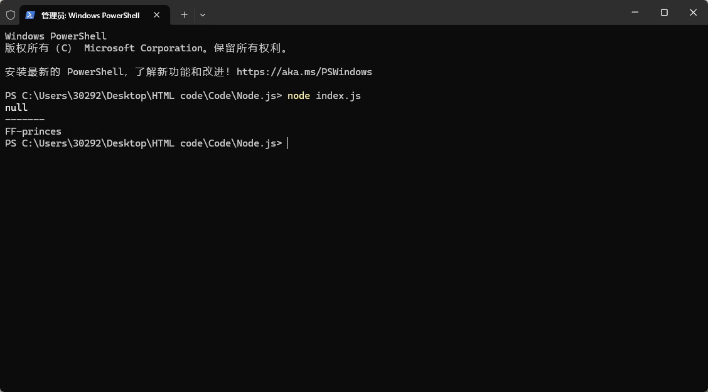

**切换当前目录下的文件夹："cd + 文件夹名"**


## 基本

### 读取数据

**在运行后输入参数，空格会影响读入（输入时不用缩进）**

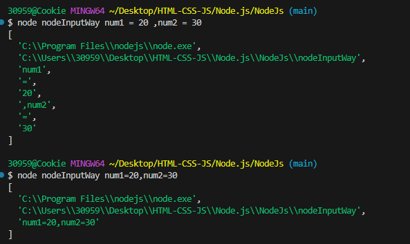

### 全局对象

```javascript
console.log(global);
// console.log("------");
// console.log(__dirname);//特殊全局
// console.log("------");
// console.log(__filename);//特殊全局
// console.log("------");
// console.log(process.argv);
// console.log("------");
// console.log(process.nextTick);
console.log("------");
console.log(globalThis === global);//true
```


### CommonJS

**CommonJS** 是一种 JavaScript 模块化规范，主要用于 **服务端（Node.js）** 和部分浏览器环境（需打包工具转换）。它的设计目标是让 JavaScript 能像其他语言（如 Python、Java）一样，通过 `require` 和 `module.exports` 实现模块的导入和导出。

**Node**是CommonJS在服务器端一个具有代表性的实现

**Browserify**是CommonJS在服务器中的一种实现

**webpack打包工具**具备对CommonJS的支持和转换

|   **对比项**   |          **CommonJS**          |               **ES6 Modules**                |
| :------------: | :----------------------------: | :------------------------------------------: |
|    **语法**    | `require()` / `module.exports` |             `import` / `export`              |
|  **加载方式**  |       同步（适合服务端）       |              异步（适合浏览器）              |
|  **静态分析**  |  不支持（无法 Tree Shaking）   |            支持（可优化打包体积）            |
|  **运行环境**  |        Node.js 原生支持        | 浏览器需 `<script type="module">` 或打包工具 |
| **模块作用域** |   动态绑定（运行时确定依赖）   |          静态绑定（编译时确定依赖）          |

#### **导出**

**exports && module.exports**

可以对模块内容导出

```javascript
const utilsName = "utils";

function formatCount(){
    return 2000
};

function formatDate(){
    return "2025-5-14";
};

exports.utilsName = utilsName;
exports.formatCount = formatCount;
exports.formatDate = formatDate;
```


#### **导入**

**require函数**

可以导入**其他模块（自定义模块，系统模块，第三方库模块）**中的内容

```javascript
const utilsObj = require('./utils');

const {
    utilsName,
    formatCount,
    formatDate
} = utilsObj;

console.log(utilsName);
console.log(formatCount());
console.log(formatDate());
```


### 导入导出本质：引用赋值

在 Node.js 中，模块的导出和导入本质上是 **对对象的引用赋值**（类似于变量赋值），而不是值的拷贝。这意味着：

**1.导出的对象是共享的**（修改会影响所有导入方）。

**2.导入的是原始对象的引用**（而非深拷贝）。

**utils**

```javascript
const utilsName = "utils";

function formatCount(){
    return 2000
};

function formatDate(){
    return "2025-5-14";
};

exports.utilsName = utilsName;
exports.formatCount = formatCount;
exports.formatDate = formatDate;

setTimeout(() => {
    exports.utilsName = "Cookie";
},2000)
```

**bar**

```javascript
let bar = require('./utils.js');
console.log(bar.utilsName);

setTimeout(() => {
    console.log(bar.utilsName);
},4000);

```


### module.exports

tips：导出文件也会被执行（例：导出B，导入A，优先执行B再A），如果有多个导入，则按导入顺序执行

**Node导出的本质就是在导出module.exports对象**

`module.exports`的本质实际上是在内存中创建一个module对象，而 `exports` 是 `module.exports` 的一个引用

```javascript
console.log(module.exports === exports); // true
```

在 Node.js 中，`module.exports` 是 **模块系统的核心机制**，用于定义模块的对外接口。它的本质是：

**1.模块的默认导出对象**（初始为空对象 `{}`）。

**2.通过赋值或修改来决定模块的导出内容**。

**3.与 `exports` 的关系**：`exports` 是 `module.exports` 的引用（但直接赋值 `exports` 会断开引用）。


**开发写法**

为什么这样写？

**可以直接开辟一个新空间，而不再影响模块文件，模块内部变量的修改也不会再影响导出的对象**

```javascript
module.exports = {
	name,
	age,
	say
};
```


### require查找细节

#### **1. `require` 的基本语法**

```javascript
const module = require('module-name');
```

`require()` 可以接受以下几种形式的参数：

- **核心模块**（如 `fs`、`path`）
- **文件模块**（相对路径或绝对路径，如 `./module.js`、`/home/user/module.js`）
- **目录模块**（如 `./dir`，Node.js 会尝试查找 `index.js` 或 `package.json`）
- **第三方模块**（如 `lodash`，从 `node_modules` 加载）

------

#### **2. `require` 查找模块的完整流程**

Node.js 在解析 `require()` 时，会按照以下顺序查找模块：

##### **(1) 核心模块优先**

如果 `require` 的参数是 Node.js 内置的核心模块（如 `fs`、`path`、`http`），则直接加载，不再继续查找。

**示例**：

```javascript
const fs = require('fs'); // 直接加载 Node.js 内置的 fs 模块
```

------

##### **(2) 相对路径或绝对路径**

如果 `require` 的参数以 `./`、`../` 或 `/` 开头，则 Node.js 会将其视为 **文件路径**，并尝试按以下方式解析：

###### **① 精确匹配 `.js`、`.json` 或 `.node` 文件**

- **`.js` 文件**：直接加载 JavaScript 文件。
- **`.json` 文件**：读取 JSON 文件并解析为对象。
- **`.node` 文件**：通过 `process.dlopen()` 加载二进制插件（C/C++ 扩展）。

**示例**：

```javascript
const myModule = require('./myModule.js'); // 加载 ./myModule.js
const config = require('./config.json');   // 加载 ./config.json 并解析为对象
```

###### **② 如果路径没有扩展名，Node.js 会尝试补全**

Node.js 会按以下顺序尝试补全扩展名：

1. `.js`（默认）
2. `.json`
3. `.node`

**示例**：

```javascript
const myModule = require('./myModule'); // 依次尝试：
                                        // ./myModule.js → ./myModule.json → ./myModule.node
```

###### **③ 如果路径是一个目录**

如果 `require` 的参数是一个目录（如 `./dir`），Node.js 会尝试查找：

1. **`index.js`**（默认入口文件）
2. 如果 `index.js` 不存在，则检查 `package.json` 中的 `main` 字段指定的文件。
3. 如果 `package.json` 也没有 `main` 字段，则报错 `Cannot find module`。

**示例**：

```markdown
dir/
├── index.js       # 如果存在，会被加载
└── package.json   # 如果存在，检查 "main" 字段
```

------

##### **(3) 第三方模块（`node_modules` 查找）**

如果 `require` 的参数不是核心模块，也不是相对/绝对路径，则 Node.js 会认为它是一个 **第三方模块**，并按照以下规则查找：

###### **① 在 `node_modules` 目录中查找**

Node.js 会从当前文件所在目录开始，逐级向上查找 `node_modules` 目录，直到根目录或找到模块为止。

**查找顺序**：

```markdown
./node_modules/module-name
../node_modules/module-name
../../node_modules/module-name
...
/node_modules/module-name
```

**示例**：

```markdown
project/
├── node_modules/      # 当前目录的 node_modules
│   └── lodash/        # 可能在这里
└── src/
    ├── index.js       # 如果 require('lodash') 找不到，会继续往上级找
    └── node_modules/  # 也可以有自己的 node_modules
```

###### **② 如果模块名包含 `/`，则视为路径**

如果模块名包含 `/`（如 `@scope/package` 或 `some/path/to/module`），则 Node.js 会将其视为 **自定义包名或路径**：

- `@scope/package` → 查找 `node_modules/@scope/package`（支持 npm scoped packages）
- `some/path/to/module` → 查找 `./some/path/to/module`（相对路径）

**示例**：

```javascript
const lodash = require('lodash');          // 从 node_modules 查找
const customModule = require('./lib/customModule'); // 相对路径
```

###### **③ 如果模块是 npm 包，Node.js 会读取 `package.json`**

如果模块是一个 npm 包，Node.js 会检查其 `package.json` 中的 `main` 字段，以确定入口文件：

- 如果 `main` 字段存在，则加载该文件。
- 如果 `main` 字段不存在，则默认加载 `index.js`。

**示例**：

```json
// package.json
{
  "name": "my-module",
  "main": "./lib/index.js" // Node.js 会加载 ./lib/index.js
}
```

------

##### **(4) 缓存机制**

Node.js 会对已加载的模块进行缓存，避免重复加载：

- **第一次 `require`**：执行模块代码，并缓存 `module.exports`。
- **后续 `require`**：直接返回缓存的 `module.exports`，不再执行代码。

**示例**：

```javascript
// a.js
console.log('a.js loaded');
module.exports = { value: 42 };

// b.js
const a1 = require('./a'); // 打印 "a.js loaded"
const a2 = require('./a'); // 不打印，直接返回缓存
console.log(a1 === a2);    // true（同一个对象）
```

------

#### **3. 特殊情况**

##### **(1) 循环依赖**

如果模块 A 依赖模块 B，而模块 B 又依赖模块 A，Node.js 会通过缓存机制避免无限循环：

- 模块 A 加载时，先执行部分代码，并缓存 `module.exports`（此时可能未完全初始化）。
- 模块 B 加载时，可以访问到模块 A 的缓存对象（但可能未完全初始化）。

**示例**：

```javascript
// a.js
console.log('a.js start');
const b = require('./b');
console.log('a.js end');
module.exports = { value: 42 };

// b.js
console.log('b.js start');
const a = require('./a'); // 此时 a.js 已执行部分代码，但未完成
console.log('b.js end');
module.exports = { value: a.value }; // a.value 可能是 undefined

// main.js
const a = require('./a');
console.log(a); // { value: 42 }
```

**运行结果**：

```markdown
a.js start
b.js start
b.js end
a.js end
{ value: 42 }
```

**结论**：

- 模块 B 在加载时，模块 A 尚未完全初始化，因此 `a.value` 可能是 `undefined`。
- 避免在模块初始化阶段依赖未完全加载的模块。

------

##### **(2) 动态 `require`**

如果 `require` 的参数是动态的（如变量），Node.js 无法在编译时优化，但仍会按照上述规则查找模块。

**示例**：

```javascript
const moduleName = 'fs'; // 动态模块名
const fs = require(moduleName); // 加载 fs 模块
```

------

#### **4. 总结**

|  **查找规则**  |                        **说明**                         |
| :------------: | :-----------------------------------------------------: |
|  **核心模块**  |                如 `fs`、`path`，直接加载                |
|  **相对路径**  |     如 `./module.js`，按 `.js`/`.json`/`.node` 查找     |
|  **目录模块**  | 如 `./dir`，查找 `index.js` 或 `package.json` 的 `main` |
| **第三方模块** |     在 `node_modules` 中查找，支持 `@scope/package`     |
|  **缓存机制**  |           已加载的模块会被缓存，避免重复加载            |
|  **循环依赖**  |        通过缓存机制处理，但需注意变量初始化问题         |

**关键点**：

1. **`require` 查找顺序**：核心模块 → 文件路径 → `node_modules`。
2. **缓存机制**：已加载的模块不会重复执行。
3. **循环依赖**：Node.js 能处理，但需注意变量初始化顺序。
4. **动态 `require`**：按规则查找，但无法静态优化。


### 模块的加载过程

**结论一：模块在被第一次引入时，模块中的JS代码会被运行一次**

**结论二：模块被多次引入时，会缓存，最终只会加载（运行）一次**

why？

每个模块对象module都有一个属性：**loaded**

为false表示话没有加载完成，为true表示已经加载

**结论三：如果有循环引入，那么加载顺序？**

Node采用的是**深度优先算法(DFS)**：main -> aaa -> ccc -> ddd -> eee -> bbb

如下图的图结构：

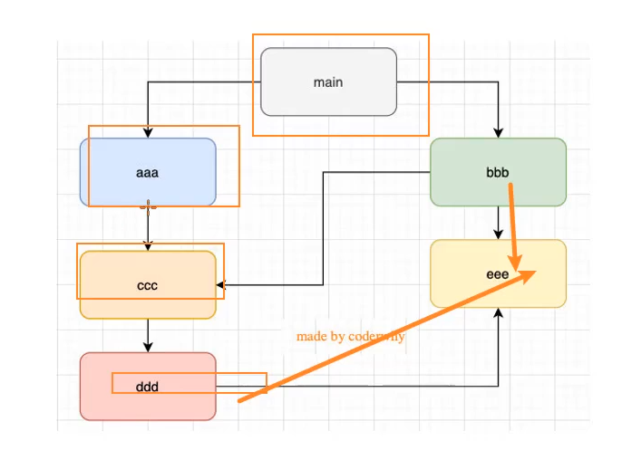


## 模块

### 1.读取文件内容

```javascript
// 使用fs模块
//导入fs模块
const fs = require('fs')

// 读取文件内容
// 1.文件路径
// 2.编码格式
// 3.回调函数
fs.readFile('./files/1.txt','UTF-8',function(err,dataStr){
    // 读取成功err值为null,失败为undefined
    console.log(err)
    console.log('-------')
    console.log(dataStr)
})
```


### 2.写入文件内容

```javascript
const fs = require('fs')

// 写入文件内容(覆盖原有内容)
// 1.文件路径
// 2.写入内容
// 3.回调函数
// 编码默认UTF-8
fs.writeFile('./files/1.txt','FF-princes',function(err){
    // 成功写入err值为null , 如果失败则为错误对象
    if(err){
        return console.log('文件写入失败！' + err.messge)
    }
    console.log('文件写入成功')
})
```


***练手案例***

```javascript
const fs = require('fs');


fs.readFile('./files/grade_old.txt','UTF-8',function(err,dataStr){
    if(err){
        return console.log('文件读取失败: ' + err.message);
    }
    console.log('文件读取成功: ' + dataStr);

    const arry_old =  dataStr.split(' ');

    const arry_new = [];

    arry_old.forEach(items => {
        arry_new.push(items.replace('=',': '));
    })

    // console.log(arry_new);

    const newStr = arry_new.join('\r\n');

    // console.log(newStr);

    fs.writeFile('./files/grade_new.txt',newStr,function(err){
        if(err){
            return console.log('文件写入失败！' + err.message)
        }

        console.log('写入成绩成功！')

        console.log(newStr)

    })

})
```


### 3.FS文件系统模块


***但绝对路径会导致一个问题，当代码移植到其他设备上时，文件路径改变，要不断更改。Result:移植性差，不利于维护***


***解决方案：__dirname***

```javascript
//__dirname 表示文件当前所处目录
console.log(__dirname);

const fs = require('fs');

//拼接文件路径
fs.readFile(__dirname + '/files/grade_new.txt','UTF-8', function(err,dataStr){
    if(err){
        return console.log('Failed to read the content' + err.message);
    }
    console.log(dataStr)
})
```


### 4.Path路径模块


```javascript
// 导入path路径模块
const path = require('path');

//使用path.join进行文件路径拼接
const pathStr1 = path.join('/a','/b/c','../','./d','e');
console.log(pathStr1); // '../' 会抵消掉前面一个路径 , 输出\a\b\d\e

const pathStr2 = path.join(__dirname,'./files/grade_new.txt');
console.log(pathStr2);

fs.readFile(path.join(__dirname,'./files/grade_new.txt'),'UTF-8',function(err,dataStr){
    if(err){
        return console.log(err.meassage);
    }
    console.log(dataStr);
})

//path.basename
const fpath = '/a/b/c/index.html'; //文件的存放路径

var fullName = path.basename(fpath);
console.log(fullName);//输出 index.html

var name_without_ext = path.basename(fpath,'.html');
console.log(name_without_ext);//输出 index

//path.extname() 获取文件扩展名
const fpath_ext = '/a/b/c/index.html';

const fext = path.extname(fpath_ext);
console.log(fext);
```


***小练习（拆解文件夹目录下html文件的CSS和JS部分）***


```javascript
const fs = require('fs');
const path = require('path');

//[]内为匹配内容 \s 代表空白字符; \S 代表非空白字符; *表示匹配任意次;
const get_Style = /<style>[\s\S]*<\/style>/;
const get_JS = /<script>[\s\S]*<\/script>/;

fs.readFile(path.join(__dirname,'./files/index.html'),'UTF-8',function(err,dataStr){
    if(err){
        return console.log('Fail to find the document!' + err.message);
    }
    resolveCSS(dataStr);
    resolveJS(dataStr);
    resolveHTML(dataStr);
})

function resolveCSS(htmlStr){
    const r1 = get_Style.exec(htmlStr);
    const new_CSS = r1[0].replace('<style>','').replace('</style>','');

    fs.writeFile(path.join(__dirname,'./files/path-text/index.css'),new_CSS,err => {
        if(err)return console.log('Fail to put in the style' + err.message);
        console.log('OK!');
    })
}

function resolveJS(htmlStr){
    const r1 = get_JS.exec(htmlStr);
    const new_JS = r1[0].replace('<script>','').replace('</script>','');

    fs.writeFile(path.join(__dirname,'./files/path-text/index.js'),new_JS,err => {
        if(err)return console.log('Fail to put int the Javascript' + err.message);
        console.log('OK!');
    })
}

function resolveHTML(htmlStr){
    const new_HTML = htmlStr
    .replace(get_Style,'<link rel="stylesheet" href="./path-text/index.css">')
    .replace(get_JS,'<script src="./path-text/index.js"></script>')

    fs.writeFile(path.join(__dirname,'./files/index.html'),new_HTML,err => {
        if(err)return console.log('Fail to put into html' + err.message);
        console.log('OK!!!');
    })
}
//执行过一次后原代码改变
//在此之后改代码再次运行则会出错
//可以把文件还原
```


### 5.HTTP模块

#### 1.概念

***“http” 是 “HyperText Transfer Protocol” 的缩写，即超文本传输协议。它是一种用于分布式、协作式和超媒体信息系统的应用层协议，是互联网上应用最为广泛的一种网络协议之一。***

以下是关于 HTTP 的一些关键信息：

1. **基本功能**：HTTP 定义了客户端（如浏览器）如何向服务器请求资源（如网页、图片、视频等），以及服务器如何响应这些请求。客户端通过发送 HTTP 请求消息与服务器进行通信，服务器接收到请求后进行处理，并返回包含请求资源或相关状态信息的 HTTP 响应消息。
2. **请求方法**：常见的 HTTP 请求方法有 GET（用于获取资源）、POST（用于提交数据到服务器，如表单提交）、PUT（用于更新资源）、DELETE（用于删除资源）等。
3. **URL**：通过统一资源定位符（URL）来标识要访问的资源，例如 `https://www.example.com/index.html` ，其中 `http` 或 `https` 是协议部分，`www.example.com` 是服务器地址，`/index.html` 是资源路径。
4. **HTTP 状态码**：服务器在响应中使用状态码来表示请求的处理结果，如 200 表示请求成功，404 表示资源未找到，500 表示服务器内部错误等。


***在网络节点中，负责消费资源的电脑叫客户端；负责对外提供网络资源的电脑，叫做服务器。***


***http模块导入***

```javascript
const http = require('http');
```


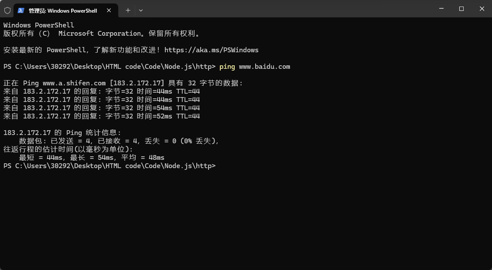


```javascript
// 导入http模块
const http = require('http');
// 创建Web服务器
const server = http.createServer();
// 为服务器实例绑定 request 事件 监听客户端请求
server.on('request',function(req,res) {
    console.log('Someone visit our Web server.');
})

server.listen(8080,function(){
    console.log('server running at http://127.0.0.1:8080')
})
```


```javascript
const http = require('http');
const server = http.createServer();

//req为请求对象 ， 包含了与客户端相关的数据和属性
server.on('request',(req,res) => {
    //URL地址
    const url = req.url;
    //客户端请求的method类型
    const method = req.method; 

    const str = `Your request url is ${url} , and request method is ${method}`;

    console.log(str);
	//解决响应中文乱码问题 调用setHeader() 设置Content-Type 响应头 
    res.setHeader('Content-Type','text/html ; charset=UTF-8')
	//res.end()用于把内容响应给客户端
    res.end('你好');
});

server.listen(80,() => {
    console.log('Server running at http://127.0.0.1');
})
```


***根据url不同响应，返回给客户端不同结果***


```javascript
const http = require('http');

const server = http.createServer();

server.on('request',(req,res) => {

    const url = req.url;

    let content = '404 Not found';

    const method = req.method;

    if(url === '/' || url == '/index.html')content = '<h1>首页</h1>';
    else if(url === '/about.html')content = '<h1>关于首页</h1>';

    res.setHeader('Content-Type','text/html ; charset=UTF-8');

    res.end(content);

})

server.listen(80, () => {
console.log('server running at http://127.0.0.1');

})
```


# ES Module

## 导入导出

**main**

```javascript
//导入方式一
// import {name,age,say} from "./foo.js";

//导入方式二, 给标识符起别名
// import {name as fname , age , say} from  "./foo.js";

// console.log(fname);
// console.log(age);
// say();

//导入方式三, 给整个模块起别名
import * as foo from "./foo.js";

console.log(foo.name);
console.log(foo.age);
console.log(foo.say());
```

**foo**

```javascript
const name = " Cookie";
const age = 19;
function say() {
    console.log("sayHello");
};


//导出方式一
export {
    name,
    age,
    say
}

//导出方式二, 给标识符起别名
// export {
//     name as fname,
//     age,
//     say
// }

//导出方式三
// export const fname = "Popguys";
```


### 结合

直接导入再导出

```javascript
//阅读性强
export { 
	formatCount,
	formatDate 
} from "./format.js"

export * from "./format.js";//全部导出
```


## ***默认导出导入（掌握）***

ES Module (ESM) 的默认导出(default export)是 JavaScript 模块系统中一种特殊的导出方式，它允许模块导出一个默认值，导入时可以自定义名称。

### 1. 默认导出语法（掌握）

#### 基本语法

```javascript
// 导出单个默认值（函数、类、对象等）
export default function() {
  return 'Hello World';
}

// 或者先定义再导出
function greet() {
  return 'Hello World';
}
export default greet;

// 也可以导出对象/类等
export default class Person {
  constructor(name) {
    this.name = name;
  }
}
```

**注意事项**

- **一个模块只能有一个默认导出**
- 默认导出的值可以是任意类型：函数、类、对象、原始值等
- 默认导出没有名称，导入时可以自由命名

### 2. 默认导入语法（掌握）

#### 基本导入

```javascript
// 导入默认导出
import myFunction from './module.js';

// 使用
myFunction(); // 调用默认导出的函数
```

### 自定义名称

```javascript
// 可以随意命名导入的默认导出
import greet from './module.js';
import welcomeMessage from './module.js';
import PersonClass from './module.js';

greet(); // 调用
const p = new PersonClass();
```

### 3. 混合导入（命名导出 + 默认导出）

当模块同时有命名导出和默认导出时：

```javascript
// module.js
export const PI = 3.14;
export function square(x) { return x * x; }
export default class Circle {
  constructor(radius) { this.radius = radius; }
}
```

### 导入方式

```javascript
// 方式1：分开导入
import Circle from './module.js';
import { PI, square } from './module.js';

// 方式2：混合导入（默认导出在前）
import Circle, { PI, square } from './module.js';

// 方式3：导入所有命名导出为对象
import Circle, * as MathUtils from './module.js';
console.log(MathUtils.PI); // 3.14
console.log(MathUtils.square(2)); // 4
```

### 4. 默认导出的实际应用场景

#### 1. 导出主要功能

```javascript
// utils.js
export default function formatDate(date) {
  // 格式化日期的实现
}
```

#### 2. 导出类

```javascript
// components.js
export default class Button {
  // 按钮组件实现
}
```

#### 3. 导出配置对象

```javascript
// config.js
export default {
  apiUrl: 'https://api.example.com',
  timeout: 5000
};
```

### 5.与 CommonJS 的区别

|   特性   |    ES Modules 默认导出     |         CommonJS 导出         |
| :------: | :------------------------: | :---------------------------: |
| 导出方式 |      `export default`      |    `module.exports = ...`     |
| 导入方式 |  `import name from '...'`  | `const name = require('...')` |
|  值绑定  |   静态绑定（编译时确定）   |    动态绑定（运行时确定）     |
| 多重导出 | 一个模块只能有一个默认导出 |        可以有多个导出         |
| 导入命名 |     可以自定义导入名称     |    必须使用导出的原始名称     |

**6. 注意事项**

1. **默认导出没有名称**：在导出时不需要名称，在导入时可以自由命名

2. 

   导入顺序：在混合导入时，默认导出必须放在前面

   ```javascript
   // 正确
   import Component, { helper } from './module.js';
   
   // 错误
   import { helper }, Component from './module.js'; // 语法错误
   ```

3. **TypeScript 中的使用**：在 TypeScript 中，默认导出会被视为模块的命名空间的一部分

4. 动态导入：动态导入也支持默认导出

   ```javascript
   const module = await import('./module.js');
   module.default(); // 调用默认导出
   ```

### 7. 最佳实践

1. 对于模块的主要功能或类，使用默认导出
2. 对于辅助函数或常量，使用命名导出
3. 保持一致性 - 在项目中统一使用一种导出风格
4. 避免在一个模块中同时使用太多默认导出和命名导出

默认导出提供了灵活性，使得导入时可以自定义名称，这在某些场景下非常有用，特别是当模块的主要功能需要一个简洁的名称时。


## ESModule解析

**注：导出时的写法({})，不代表是对象，而是一个语法结构**

```javascript
export {
	name,
	age,
	//不是对象语法
    foo:"abc"//报错
}
```


**阶段一：构建阶段**

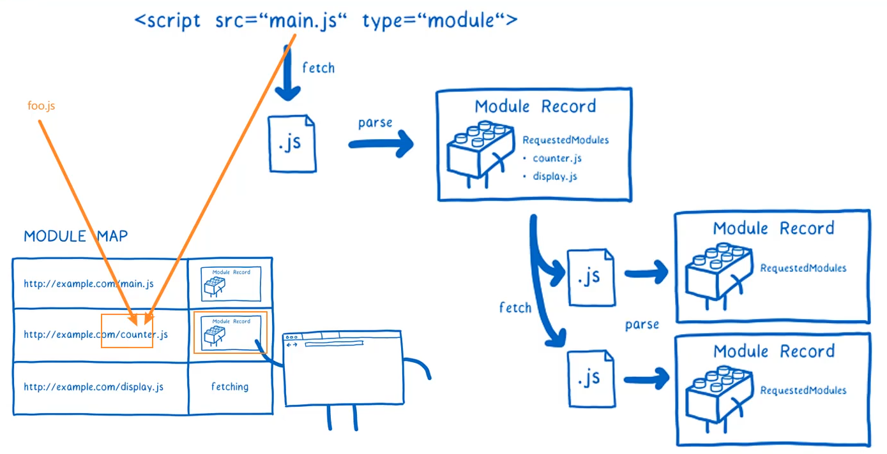

**阶段二和三：实例化阶段 - 求值阶段**

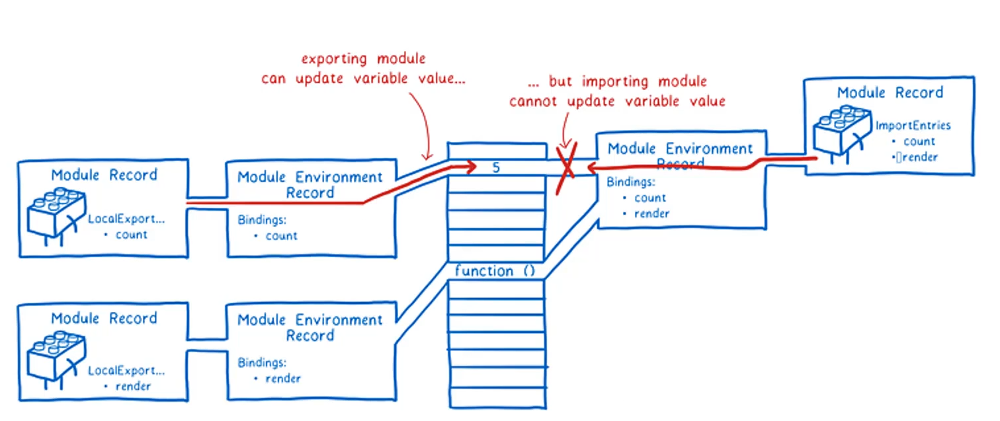

**解析流程**

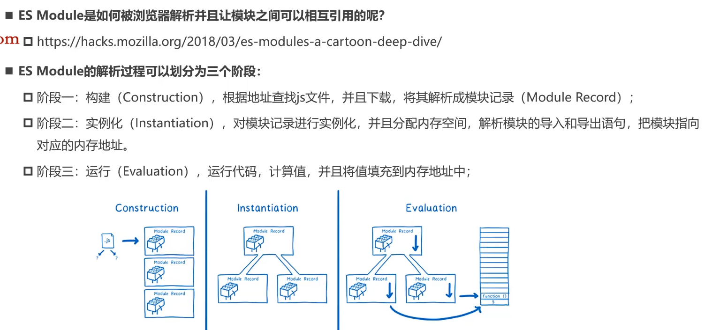


# 包管理工具

### **包管理工具npm**

Node Package Manager，也就是Node管理器

前端项目中有使用npm管理依赖的包

如：vue，vue-router，vuex，express，koa，react，react-dom，axios，babel，webpack等


### npx工具

在文件夹内终端运行`npm init -y`初始化

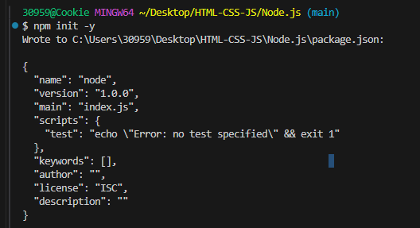

输入`webpack`对项目进行打包（对文件进行压缩，过程称之为丑化）

生成一个`dist`文件（distribution），将打包好的项目放入其中

**在package.json里的script里的执行优先在node_modules里寻找，若找不到再扩展至全局寻找**

所以npx可以不用写

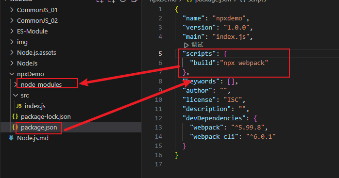


### 局部命令的执行

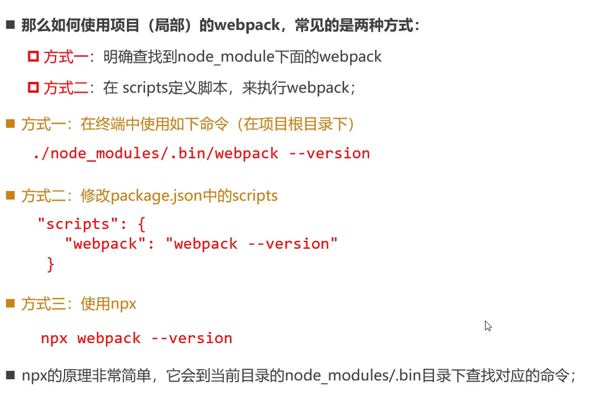

## npm发布包

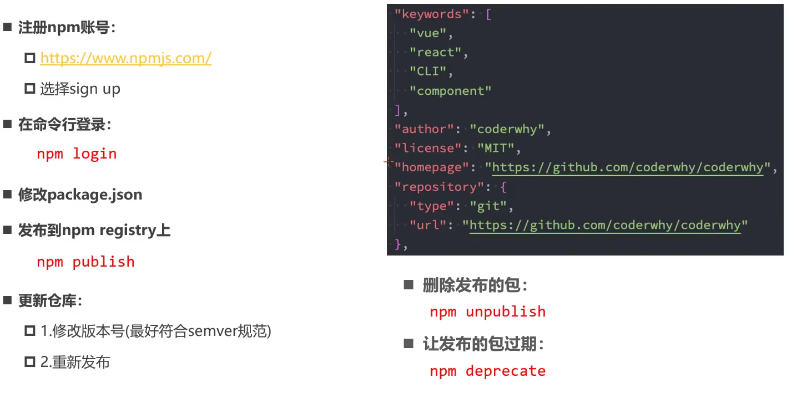
